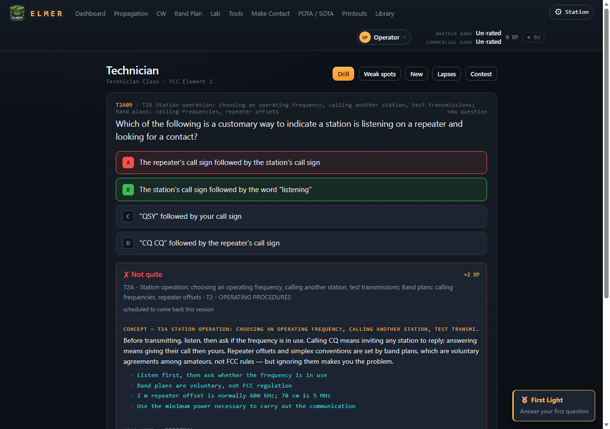
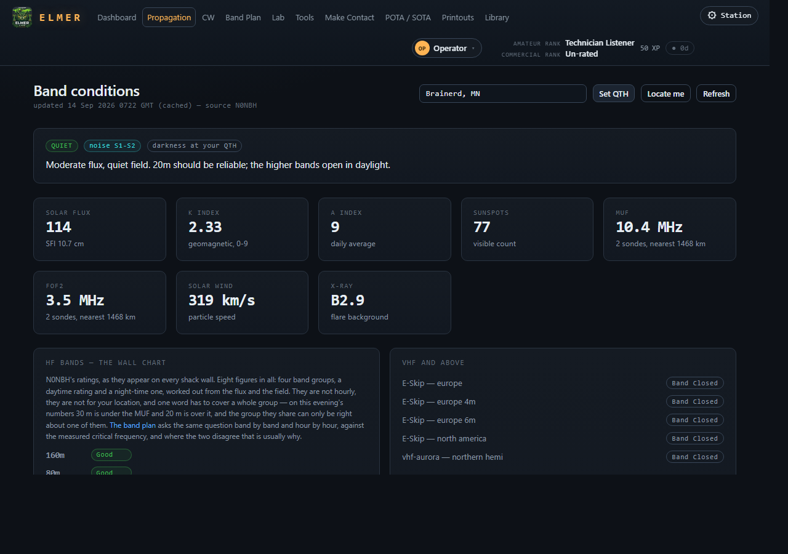
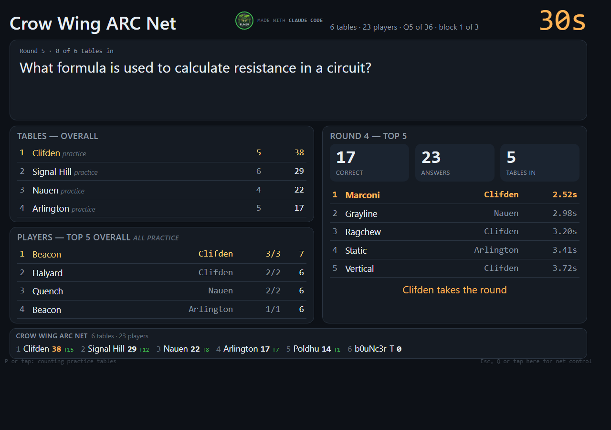

# ELMER

A study assistant, progress tracker and game for the United States radio
operator examinations — the amateur pools (Technician, General, Extra) and
the commercial ones (MROP, GROL, Ship Radar), every question with an
explanation, mock exams built to the real blueprint, a live band-conditions
page, a lab of the calculators the exams test, and a tournament that runs
on one Raspberry Pi for a table of phones or across a hall of a hundred
tables from one more. It runs on a Raspberry Pi, a Linux box or a Windows
laptop, and the browser on any phone or laptop on the same network is the
screen.

**License:** [PolyForm Noncommercial 1.0.0](LICENSE) — free for personal
study, clubs, schools and other noncommercial use; not for commercial use;
deliberately not an OSI open-source license.

## What it looks like

| | |
|---|---|
|  |  |
| The dashboard — your standing by class, live band conditions, every pool a card. | A drill: the answer, the explanation, the concept it belongs to, and a note of your own. |
|  |  |
| The band plan — privileges from 47 CFR, activity by colour, and what the band is doing this hour. | Band conditions — the live figures, and where this hour's measured sky disagrees with the wall chart, it says so. |
|  | |
| The hall's big board, six tables in, round five. | |

## Install

On a Raspberry Pi or any Linux machine:

```
git clone https://github.com/skpeterson2000/elmer.git
cd elmer
./install.sh           # installs what is missing and nothing that is not
./elmer.py             # serve; open it from anywhere on the network
./elmer.py --kiosk     # serve, and open full screen on this machine
#   ELMER is on http://192.168.1.5:5000
```

On Windows: clone the same way (or download the source zip from GitHub),
open PowerShell in the folder and run `.\install.ps1`, then double-click
`elmer.cmd`. It opens in a window of its own and puts itself on the Start
Menu. A portable zip that needs no install is built for every `v` tag; the
first tag has not been cut yet, so it is not on the *Releases* page today.

The pools ship built: it runs straight from a clone, and nothing leaves the
unit unless you press for it.

## The pools

| Pool | Element | Questions | Exam | Pass | Release |
|---|---|---|---|---|---|
| Technician | 2 | 409 | 35 | 26 | 2026–2030 pool, current to the NCVEC's revision of 19 Feb 2026 |
| General | 3 | 423 | 35 | 26 | 2023–2027 pool, current to the NCVEC's 6th revision, 4 Feb 2026 |
| Amateur Extra | 4 | 599 | 50 | 37 | 2024–2028 pool, current to the NCVEC's 4th revision, 4 Feb 2026 |
| Marine Radio Operator Permit | 1 | 144 | 24 | 18 | FCC pool of 2009, the one in use |
| GROL — General Radiotelephone | 3 | 600 | 100 | 75 | FCC pool of 2009, the one in use |
| Ship Radar Endorsement | 8 | 300 | 50 | 38 | FCC pool of 2009, as revised 6 Mar 2024 |

2,475 questions. Every explanation is written by hand or quoted from 47 CFR;
none is machine-generated, and where none exists the program says so.

## Requirements

Python 3.11 or later with Flask, Pillow and reportlab (`requirements.txt`);
`install.sh` fetches them with apt on Raspberry Pi OS and a virtual
environment elsewhere, `install.ps1` on Windows. Optional, and named by the
self-check when missing: poppler-utils to rebuild the pools or read PDFs on
the library shelf; pyserial to talk to a NanoVNA. Serving needs no network;
the band-conditions page, the callsign lookup, the gazetteer and the updater
reach out, and *What leaves a unit* under [Fidelity](DESIGN.md#fidelity)
in DESIGN.md lists exactly what leaves a unit and when.

## Status

**Version.** ELMER is versioned by build: the short commit id on the
dashboard and in every problem report. This page describes the build of
**14 September 2026**; [CHANGELOG.md](CHANGELOG.md) is one line a commit, by
day. The dashboard's *Update now* brings a unit to the current build.

**Who runs it.** Three Raspberry Pis and a Windows laptop on the author's
bench, and the tests. No club has run an evening on it yet; the first that
does gets named here, with the date.

**What does not work yet.**

- The portable Windows zip is built but not released — no `v` tag yet.
- A net puts one question to every table; a different game to each table
  at once is not built.
- Golf has no handicap switch in the hall (it has one at a table), and a
  tie for a block is decided by a draw, not a play-off.
- A player's record and awards do not yet travel between units.
- LoRa: not started. The design is in [DESIGN.md](DESIGN.md), the radios are
  not on the bench.
- iOS cannot be a LoRa station (no Web Bluetooth in Safari); an iPhone plays
  through a table's wifi like any phone.
- The propagation forecast loses to persistence on the ledger it keeps
  about itself, and it says so on the page.

**The reasoning.** Everything about *why* it works the way it does — the
fidelity rules, the games, the propagation model and its ledger, the hall,
the tests that cannot reach your data, the Windows build — is in
[DESIGN.md](DESIGN.md). It is long on purpose; it is the notebook.

## Made with

Written by KC9SP with Claude Code; the credits and the provenance of the
artwork are in [NOTICE](NOTICE). Question pools are the current public
releases of the NCVEC and the FCC. Sources for everything else are listed at
the foot of [DESIGN.md](DESIGN.md#a-note-on-the-sources).
