# ELMER User's Guide

ELMER is a study tool and a station companion for amateur radio, built to run on a Raspberry Pi in a club hall or on a Windows laptop at home. It drills the license question pools, reads the sky, draws the band plan for the license you hold, keeps your manuals to the page, and turns a room of people with phones into a game night. This guide is the tour: what each page is for, what the buttons do, and what a page needs before it can help you.

ELMER is in pre-release. Features will continue to appear and to be refined while bugs are found and taken out, and what a feature does today may not be precisely what the final version does, where that latitude exists. The dashboard shows which build a unit is running, and the changelog says what changed and when. Where this guide and the screen disagree, the screen is newer.

## How do I - find the thing I want

This guide is long because ELMER does a lot, and a long guide is no use to somebody who wants one answer. So: the thing you want, and where it is. Each line names the chapter and the section inside it; the contents at the front gives the page, and in the PDF the chapter list down the side of the reader jumps straight there.

**Getting going**

- Start it for the first time, and get past Windows warning about it - *Getting it running*
- Use it without a callsign, a location or a network - *Before you begin*
- Tell it my callsign, my license and where I am - *Finding your way around: Your station*
- Share one unit with somebody else and keep our records apart - *Finding your way around: Who is playing*
- Find out what the row of icons at the top is doing - *Finding your way around: The status strip*

**Passing the exam**

- Start from nothing and get a Technician license - *Studying for the exam: If you read one thing, read this*
- Know what to actually do this week - *Studying for the exam: A first week*
- Sit a practice exam under the real rules - *Studying for the exam: The mock exam*
- See what I keep getting wrong, and read the pool itself - *Studying for the exam: Progress, and browsing the pool*
- Watch the maths move instead of memorizing it - *The Lab*
- Print something to study away from the screen - *Printouts*, and *The Library*

**Morse**

- Learn the code from nothing - *CW: Learn*
- Know how long to practice, and how often - *CW: How long a session is, and why it is short*
- Pick up where I left off after a day away - *CW: A set of passes does not expire at midnight*
- Show it I already know the code, and skip the crawl - *CW: Qualifying run*
- Find out what speed I copy and send at - *CW: Your rating*
- Decode what is coming out of the receiver - *CW: Decode off air*
- Practice with a real key or paddle - *CW: Your sending*

**Antennas and the station**

- Work out what antenna to build, and print its cut lengths - *The Lab: Antennas*
- Decide which way to string a wire, and see what that changes - *The Lab: Antennas*, and the figure in it
- Find out how high is high enough - *The Lab: Antennas*
- See what my feedline is costing me - *The Lab: SWR, reflection and what it actually costs you*, and *Smith chart*
- Check I am within the RF exposure rules - *The Lab: RF exposure evaluation*

**On the air**

- Find out whether a band is open right now - *Band conditions*
- See how far a band reaches from my station, this hour - *The band plan: Where the band reaches from here, now*
- Check what I am allowed to transmit, and where - *The band plan*
- Work out whether a particular contact will happen - *Make Contact*
- Plan a park or summit activation - *Parks and summits*
- Decide whether tonight is worth it for moonbounce - *EME*

**Everything else**

- Play something, alone or against other people - *The Gaming Center*
- Run a club night on one unit - *A club night*
- Put my own books and manuals on the shelf - *The Library*
- Check the unit is healthy, and update it - *Keeping ELMER healthy*
- Find out what this thing sends over the network - *What leaves this unit*
- Work out why something is not behaving - *When something goes wrong*

## Before you begin

**Nothing is required.** The Station dialog says so itself: ELMER works without a callsign, a location or a network. Each thing you give it lets it answer something it would otherwise have to ask about or guess at. A callsign fills in your license class from the FCC's own record. A location, called a QTH in the hobby, gives the propagation pages your sky and the band plan your coordinator. A network fetches the space weather and the ionosonde readings. Everything else works from a clock and what is already on the unit.

**The corner.** The name **ELMER** in the top left corner is the Dashboard button: click it from anywhere and you are home. The icon beside it does something else - click it and ELMER keys its own name in Morse to the room, the same announcement it makes when it opens, with your callsign after it if you are a supporter who asked to be named. That is the invitation to a game night, or a way to hear that the sound works, or something to show somebody; a second click starts it over. If the announcement is switched off in the Station panel, the icon is quiet and just goes home like the name.

**Two kinds of page.** Ten pages are in the bar across the top: Propagation, CW, Band Plan, EME, Lab, Tools, Make Contact, POTA / SOTA, Printouts and Library. The rest are reached from inside those: the study drill, the mock exam and your progress from the cards on the Dashboard; the Gaming Center from any pool card or the dashboard's game panel; net control, the big board, the Lounge and your license papers from links where they belong.

**Who is at the controls.** ELMER keeps a record for each person who uses it, by name. The operator chip at the top right shows who is playing now, and a click on it switches or adds somebody. Progress, notes, streaks and certificates belong to that account. The shelf of manuals and the settings of the unit itself are shared.

**What this guide does not repeat.** Installing ELMER is covered by the three quickstarts in the docs folder, one each for a Raspberry Pi, for Windows and for any other Linux. They say where to download, what to run, and what the first minute looks like. This guide starts where they leave off, with one exception below, because it is the screen most likely to stop a Windows user before they have started.

## Getting it running

### The Windows warning about an unrecognized app

The first time you start ELMER on Windows, whether from the ELMER icon or by double-clicking `elmer.cmd`, Windows may show a blue screen headed **Windows protected your PC**, saying that Microsoft Defender SmartScreen prevented an unrecognized app from starting. Your browser may say something similar when the zip is downloaded, and some antivirus programs will quarantine a new executable on sight.

Here is what that screen is, so the choice is yours and an informed one.

- **What it means.** Windows checks a program's signature against a list of publishers it knows, and a program that carries no signature, or a signature it has not seen enough times, is called unrecognized. ELMER is not signed. A code-signing certificate is bought from a certificate authority, renewed yearly, and tied to a legal identity, and a pre-release hobby project does not have one. The warning says nothing about what the program does; it says only that Windows has not met it before.
- **What the choices do.** *Don't run* closes the screen and nothing happens. ELMER does not start, nothing is installed, and nothing on your machine changes. *More info*, a small link on the screen, reveals a second button, *Run anyway*, which starts the program and remembers that you allowed this one file. It does not lower your protection for anything else.
- **What you can check first, if you want to.** ELMER's source is public, in the repository the README links to, and the zip you downloaded is built by the project's own release job from that source. You can read any of it before deciding. You can also run ELMER from the source with Python instead of from the zip, which the Windows quickstart describes; Windows treats a script it can see differently from an executable it cannot.
- **Either way is fine.** Declining costs you nothing but ELMER. Accepting is a decision about this one program from this one place. Nobody is owed a reason.

### The first start

The dashboard opens with a panel headed **Start here**, three numbered steps: answer some questions, add your callsign, and set where you are. The second and third are optional, and the panel goes away after your first answered question. On a Pi, the unit prints its address on the network when it starts, and other people on the same wifi can open ELMER at that address in their own browser.

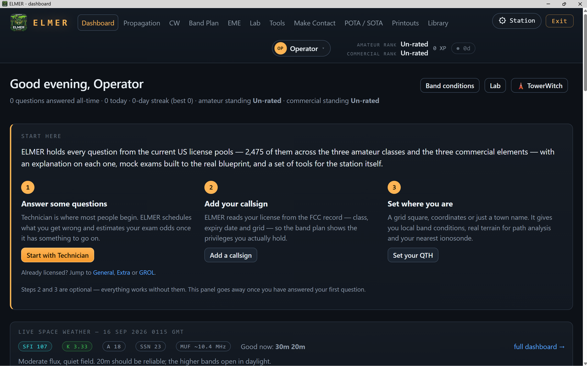

Scroll down and the rest of the first screen is already there, waiting for a record to fill it: the live space weather strip, then **Standing** - the study ranks, with the plain statement that they are ELMER's own and not licenses - the amateur track with its three classes not yet started, and below that the Gaming Center, where only Technician is open to play: the games follow the rules, and without a callsign to say what you hold, Technician is the class every game starts in.

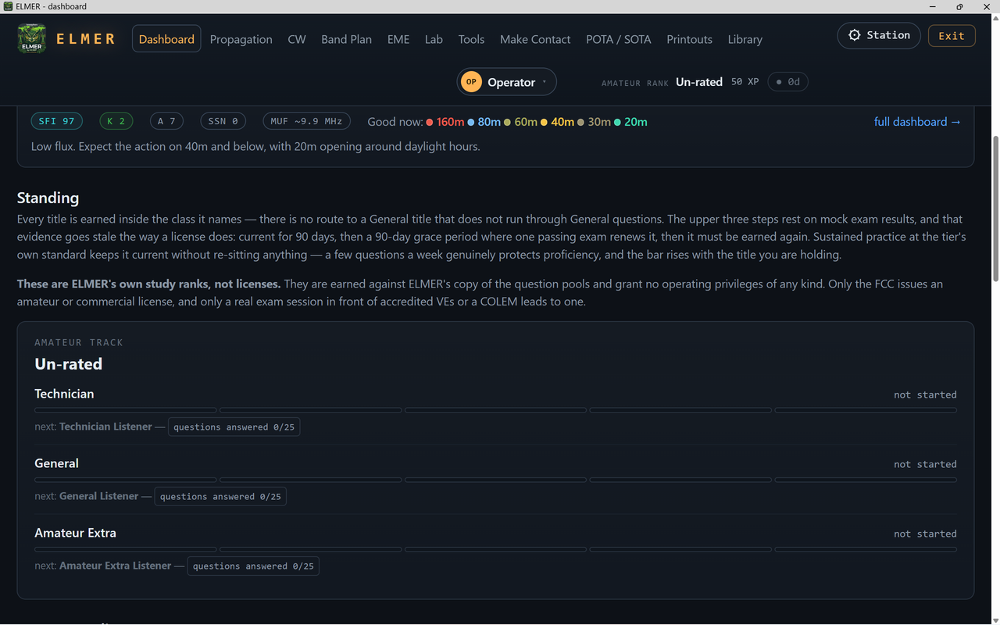

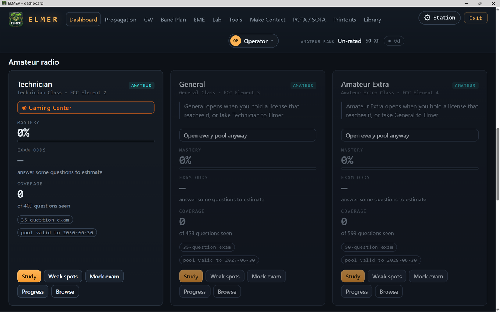

**Kiosk mode and the Exit button.** Started with `--kiosk` on a Pi, or as its own window on Windows, ELMER fills the screen and shows an **Exit** button in the top corner. Exit stops ELMER and closes the window, after asking if anyone is playing on the unit from another device. Links that lead outside ELMER open a page that says so first, with a way back, so a full-screen browser with no back button never strands you.

**A tab pressed twice.** The tabs at the top light up when pressed and ignore a second press for a moment. On a Pi a page takes a second or two to build, and the second press would throw away the first.

## Finding your way around

### The status strip

To the right of the tabs: the operator chip, your standing on each track you study, your XP, and your streak. Standing is ELMER's own study rank, five steps from Listener to Elmer, earned against its copy of the question pools; it grants no operating privilege of any kind, and the dashboard says so in bold. XP is effort, not rank. The streak is days in a row with an answer, and the tooltip remembers your best.

**Achievements.** Lower on the dashboard, thirty-four of them, filled in as they are earned: the study milestones, the mock exams passed, and twelve for the code - from First Dit to The Whole Code, the rating's rungs, and CW Baseball's Base Hit, Big League and QSM?, the first resend ever asked for in code and answered. Any badge held can be printed as a page for the wall from the Library's bottom shelf.

### A cup of coffee

ELMER is a gift to the amateur radio community, free for noncommercial use - personal study, clubs, schools, and the hobby itself. After about ten hours of actually answering questions the dashboard offers, once, a cup of coffee for the developer at github.com/sponsors/skpeterson2000, and then not again for a hundred hours more; **Thanks, not now** puts it away. A supporter who sends their callsign or name in the sponsorship note gets an eight-character key back, entered under Station with that name. With the key the dashboard says thank you instead, once a day, and says what the coffee meant: how many times ELMER has changed since, with the latest lines. The key opens nothing and its absence closes nothing; it is a thank-you, not a license. A brand-new key is checked once against the signed roster in the repository, so it wants a network for a moment or the next update before a unit accepts it.

### Your station

The **Station** button in the corner opens a dialog headed **Your station**. Nothing in it is required. The fields, in order:

- **What ELMER calls you.** A name for the top bar and the greeting.
- **Callsign.** Looked up in the FCC's own record, which fills in the license class below. The account menu shows what that record says beside your name: **licensed** only for a license in force today; **expired · renew** for one that has run out but is inside the two years to renew without retesting (it may not be used on the air in that window); **expired** past that; **cancelled** where the FCC still lists it so; and **no FCC record** where the Commission has nothing under that callsign - which is what a license lapsed long enough to have been dropped from the public file looks like, and also what a license from outside the US or a typing slip looks like, because the file cannot tell them apart. The standing is worked out from the expiry date each time it is shown, not on the day the record was fetched, so it stays true as the years go by. The record comes from the FCC's weekly license files: the first time a callsign of a kind is saved the unit fetches that service's file, about 200 MB for amateur, and from then on every callsign of that kind is answered with no network at all. Other calls held under the same FRN are listed.
- **GMRS callsign.** The record's grant and expiry, a warning that GMRS has no grace period, and a renew link under ninety days. With a GMRS license found and other accounts on the unit, a row of boxes lets you mark which accounts are your immediate family, and Make Contact then offers them the GMRS repeaters under your call.
- **Commercial operator callsign.** A GROL, an MROP, a GMDSS or a Radiotelegraph ticket; the commercial question pools come onto the dashboard with it.
- **License class.** Not licensed yet, or the class held. Enter a callsign above and the FCC record fills this in and keeps it, marked **verified**, and every screen in ELMER that offers a license class opens on it: the band plan, a table in the Gaming Center, the printed charts. You are not asked twice for something the Commission has already published.

  You can still set it by hand, and it is kept. That is for the cases the record cannot cover: a license from outside the US, which callook does not serve; an upgrade granted this week that the published file has not caught up with; a club station. An answer of your own is marked **your own word** wherever the class is shown, with the record's class beside it, and it does everything a verified class does. It opens your study pools and sets where the pickers open, because what you study is your own business. The one thing it does not do is go on paper: a chart printed with your callsign on it uses the FCC's record, because a chart with a callsign on it is read as a claim about that station.
- **The announcement.** ELMER keys its own name at twenty words a minute on 1020 Hz, once when you open the program rather than once a page. If you are a supporter who asked to be named, your callsign goes out with it: `ELMER DE KC9SP`. The room hears whose unit this is, and somebody who already knows the program hears an invitation to a game. It is the station identifying itself, and it is a plain way of hearing that the unit is up and the sound works before you go hunting for a volume control. Turn it off where it would not be welcome: a net in progress, a classroom, a field site at night. Being quiet is sometimes what being in a community asks of a station. On a unit running as an appliance it goes out the moment ELMER opens. In an ordinary browser it waits for your first click on the page: a browser keeps audio silent until a page has been touched, which is the browser's rule and not something a page can talk it out of. If it seems to arrive late, on whatever button you happened to press first, that is why. To hear it again - to check the sound, or to show somebody - click the ELMER icon in the top left corner. The icon keys the name and stays on the page; the name beside it is the Dashboard button. A second click restarts it. With the announcement switched off the icon is a plain link and keys nothing.
- **Show the commercial pools.** Three more cards on the dashboard and a second rank. Off by default; the pools are always there.
- **RepeaterBook token.** Your own token from RepeaterBook's My Account, API apps. With it, the repeaters for your state are fetched under your account and asked again when the QTH crosses a state line or a month passes. The token goes to RepeaterBook and nowhere else. Without one, ELMER reads TowerWitch's list or an import.
- **Supporter key.** The eight-character key that came back with the developer's thanks, `XXXX-XXXX`, and beside it the name it was cut for - a callsign, a name, a club - exactly as you asked to have it printed. Tick **Name me on the hall's thanks card** and a hall this unit plays in puts that name on the card between rounds; untick it and you are thanked quietly. Leave the key blank to be an operator like any other.
- **Distances in.** Kilometers, miles or nautical miles, for how far away things are. Wavelengths stay in meters and wire stays in feet, because that is what the bands are named in and how wire is sold.
- **Where you operate from.** A town, a grid square, or coordinates. A grid or a pair of coordinates is understood on the spot; a town name needs a network to look up.
- **Use this unit's position.** Asks the unit's GPS if one is talking, else the browser. A browser only offers its position on the unit's own screen, not over the network, so on another device the button stays hidden rather than failing.

**Save** writes it all and reloads the page, because the bar carries the name and the rank.

### Who is playing

Click the operator chip for the menu **Who is at the controls?** It lists every account on the unit, lets you add one with a name and an optional callsign, rename, set or change a password, and remove an account from the unit's own screen. A password stops somebody else on the unit answering questions as you, or deleting what you have done. It travels over the network in clear, so choose one you do not use elsewhere. Removing an account takes its progress, titles, notes and streak with it, and it cannot be undone.

**Sealed with your password.** An account with a password has its private data sealed: where you operate from, any token such as the RepeaterBook one, and your notes on questions. Sealed means the database file gives them to nobody - not somebody with the disk, not a backup, not the next person at the controls - because the key is made from your password and ELMER keeps it only in memory while you are signed in. Your name, callsign, rank and streak stay plain, since the room's boards show them and a callsign is a public record; so does the study record itself, which the streak and the scheduler count from and which a forgotten password should never take away. When you first set a password ELMER shows a recovery code once: write it down. The moderator key can open your account for a forgotten password but cannot open the seal; the recovery code is the only other way in, and without it a forgotten password loses what was sealed. After ELMER restarts, or on another browser, the account menu shows **Unlock**; your password opens both the account and the seal. Taking the password off unseals everything back to plain.

**A shared unit.** The Station dialog asks whether this unit is one person's or shared, and the account menu asks the same thing the first time a second account is about to be made. On a shared unit, the person at the controls is asked to put a password on their own account *before* the second account exists. That order matters: an open account can be switched into by anyone and given a password by anyone, and the first person to do that would own it, so the question is put at the one moment its owner is certainly the one at the controls. Leaving it open is a real answer and is not asked again. On a shared unit a saved token, such as the RepeaterBook token, needs a password on the account, and once saved a token is never shown again anywhere; the self-check names any account on a shared unit that is still open.

## Studying for the exam

### If you read one thing, read this

**Come back tomorrow.** ELMER decides when to show you a question again by working out when you are about to forget it, and aiming to catch you just before you do - it picks the gap so that you have about a nine-in-ten chance of still knowing the answer when it comes round. That is the whole mechanism, and it cannot work on somebody who appears once a week. Twenty minutes a day beats three hours on a Sunday, and it is not close.

**A short session is a real session.** Open the pool, press **Study**, answer what it gives you, stop when you want to. There is no session length to complete. The dashboard keeps a day streak for exactly this reason.

**Getting one wrong is not a setback, it is the point.** A question you miss comes back in about ten minutes, and then keeps a share of the spacing it had already earned rather than starting again from nothing. Pressing `?` to reveal an answer counts as wrong on purpose: guessing right teaches the program that you knew it, and then it will not show you that question again for a month.

**A week of this is worth more than the week before the exam.** A question you have known for a while can space out as far as six months, so the pool quietly gets smaller as you go and the daily session gets shorter, not longer.

### A first week

1. **Pick your pool.** Technician if you hold nothing yet. The card is on the dashboard.
2. **Press Study and answer thirty or forty questions.** You will get a lot wrong. Everybody does; nothing has been measured about you yet.
3. **Read the explanations as they open.** That is where the actual teaching is, not in the question.
4. **Come back the next day and press Study again.** It will start with what you are about to forget and then bring you new material. This is the loop, and it stays this way to the end.
5. **After three or four sessions, take a mock exam.** Not to pass it. It marks the sections you are weakest in, and it feeds everything you answer back into the schedule, so nothing about it is wasted time.
6. **Then follow the numbers on the card,** below.

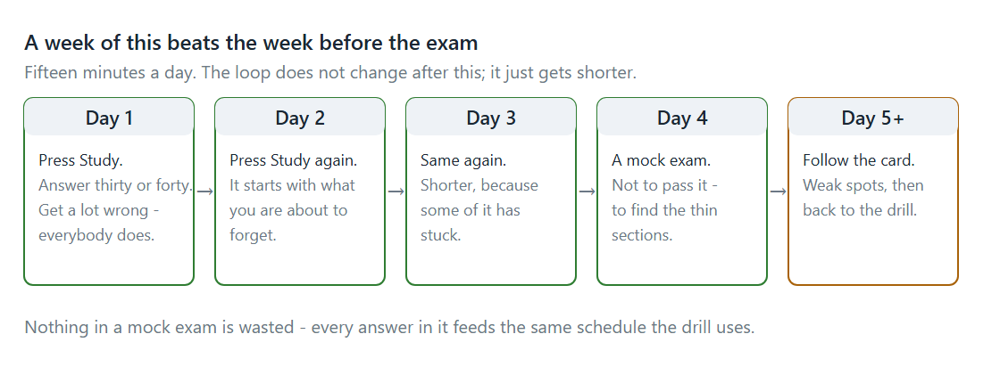

### The cards

Each question pool has a card on the dashboard: Technician, General and Extra under **Amateur radio**, and with the switch on, the Marine Radio Operator Permit, the GROL and the Ship Radar endorsement under **Commercial**. A card shows three numbers. **Mastery** is ELMER's estimate of your chance of knowing an average question right now. **Exam odds** is your chance of passing, from thousands of simulated exams against your record, and it stays deliberately pessimistic while more than a third of the pool is unseen. **Coverage** is how much of the pool you have met. Five buttons: **Study**, **Weak spots**, **Mock exam**, **Progress** and **Browse**.

Some pools are gated until you have shown something in the one before. A gated card says why, and **Open every pool anyway** does what it says.

### The drill

One question at a time. Five modes across the top, and the short answer is that **Drill** is the one to use almost always:

- **Drill** puts what is due for review first, then new material. This is the default and the one the schedule is built around. If you are not sure, press this.
- **New** shows only what you have never seen. Use it early, when you want to get round the pool faster than the drill will take you, and accept that you are meeting questions rather than learning them.
- **Weak spots** starts with what you have actually got wrong, weakest first, and only then moves on to what you have never met. Use it after a mock exam has told you where you are thin, or in the last fortnight before a test. The distinction matters: a question nobody has answered is not a weak spot, it is an unknown, and if the two are ranked together the unknowns bury the things you just missed.
- **Needs review** is everything you have got wrong, wherever you got it wrong - in the drill, in a contest round, on a mock exam, or at a table in a hall playing a hole of golf. The button carries the count, so you can see how much of it there is without going in. Use it when the same few questions keep catching you and you want them dealt with in one sitting. Nothing you answer anywhere is exempt: a revealed answer counts as a miss too, because guessing right teaches the program something that is not true.
- **Contest** is a fast random round against a clock. It is for the evening you do not feel like studying, and it still counts.

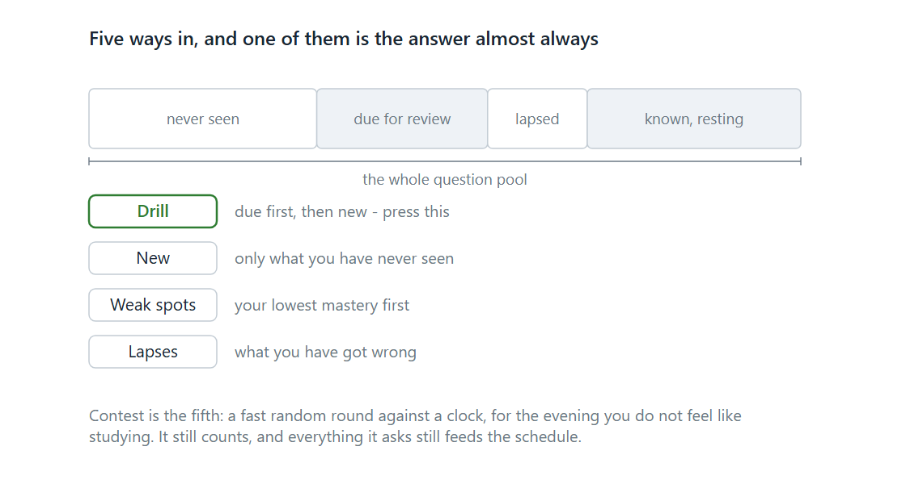

The keys: `1` to `4` or `a` to `d` answer, `space` or `Enter` moves on, `?` reveals the answer and counts as wrong, which is the honest thing to do. After you commit, the card opens: whether you were right, the XP, when it will come round again, and underneath, why this is the answer, what to watch out for, the concept it belongs to with a link to try it in the Lab where one exists, and the FCC rule with a link to the section. There is a box for your own note on any question, saved with the account. A badge earned, or a step up the rank ladder, is written into the card as well as sliding past as a toast, so it is still there when you come back to the screen.

**The run panel, under the drill.** Your run of right answers in this pool, the bar you are working against, your longest ever, and — the part worth watching — where the last few runs actually broke. It will read something like `broke at 4 → 6 → 9`, and that sequence is what learning a pool looks like from the inside. The bar starts at three and moves up a rung each time you reach it: three, five, ten, fifteen and on. **It never moves back down.** Breaking a run short of it costs you nothing at all.

Ten is the number to aim at. Ten right in a row drawn from a whole pool is about what the real paper feels like, and doing it once is partly luck — so ELMER counts them and calls it settled at three. If you can get ten in a row out of a pool on most evenings you sit down, you know that pool.

**Sound is off until you switch it on.** The speaker button at the right of the HUD turns it on and remembers your choice in that browser. You get a short blip for a right answer, a rising figure when you reach a rung, and a longer one for a badge or a promotion. A miss makes a sound too, but a low flat one rather than a buzzer — getting one wrong is how the scheduler finds what to show you again, and it is not a thing to be told off for.

### The mock exam

Built the way the real one is: the right number of questions, exactly one drawn at random from each section of the syllabus, choices shuffled, and the pass mark the real exam uses. The timer is a pace target you set yourself, not an official limit. Flag a question with `f` and come back to it from the question map; **Submit exam** scores it.

**Nothing is marked until you submit.** This is the one place in ELMER that tells you nothing while you work — no verdict on an answer, no running score, no sound, no run counter — because the real paper does not either, and the whole point of a mock is to feel like the real thing. Change any answer and move in any order right up to the moment you hand it in. The result shows the score by subelement and lets you review every question you missed, with the right answer in green and yours in red, then offers to drill the weak spots. Every answer here also feeds your review schedule.

### Progress, and browsing the pool

**Progress** is where you stand in one pool: mastery, pass probability, likely score with its range, coverage, the weakest sections to drill first, your recent mock exams, and thirty days of study as a bar chart. Below that, for somebody running a class, **Where people on this unit get lost**: the hardest questions measured from how everyone on the unit went, nobody named.

**So when do I book the test?** Read three numbers together rather than any one of them.

- **Coverage** first. Until you have met most of the pool, the other two are guesses dressed as numbers, and ELMER holds its estimate down on purpose while a third of the pool is still unseen.
- **Exam odds** next, and take the **range** on the Progress page more seriously than the single figure. A likely score whose lower end is comfortably above the pass mark is a different thing from one whose average is.
- **Your recent mock exams** last, because they are the only number here that is not a model. Three mock exams in a row, on different days, all clear of the pass mark with a margin, is the honest signal.

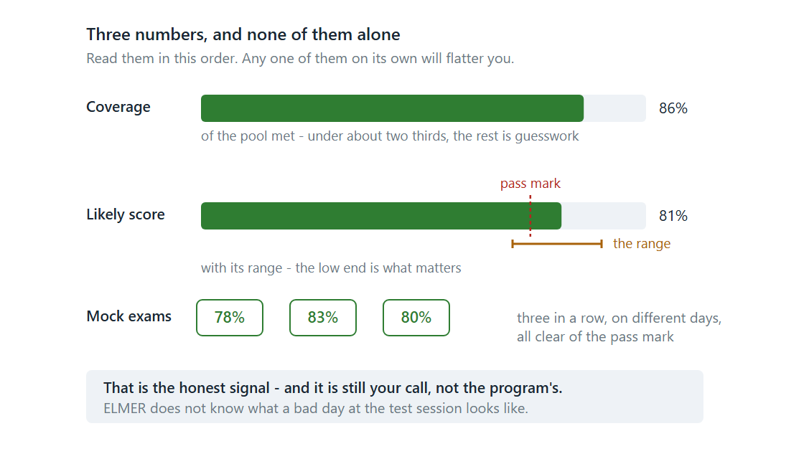

If no license is on your account's record, ELMER will say something when those numbers line up: a panel on the dashboard once a class is within reach, and again when the evidence says you are ready, with what the day actually involves — get an FRN from the FCC's CORES system beforehand, find a session, what the team will ask you for, and the Commission's fee that comes after you pass. Those are the four things that catch people out, and none of them is the exam.

It is still your call, not the program's, because ELMER does not know what a bad day at the test session looks like. What it can also tell you is whether you are still improving: if the last few mock exams are flat and the drill is mostly showing you reviews rather than new questions, you have got what this pool has to give you.

**Browse** is the pool as a book: every question in a section with the key marked and the explanation under it. Choices are in their published order here; in drills and exams they are shuffled, as they are on the real test.

## Band conditions

The **Propagation** page is the live sky. Set your QTH at the top of it, a grid, coordinates or a place name, or press **Locate me** if the unit has a fix. The verdict comes first, in a sentence, then four tiles for the solar flux, the K index, the A index and the sunspot number, then the HF wall chart and the VHF outlook.

The wall chart is N0NBH's, and the page says what it is and is not: eight figures, not hourly, not for your location, one word covering a whole group of bands. The band plan asks the same question band by band and hour by hour from the reading nearest you, and the two sometimes disagree; when they do, the band plan says so and explains why. Under the chart, **What these numbers mean** explains each indicator with its live value beside it, and **Take it to the pool** goes straight to the exam sections about propagation.

The numbers come from hamqsl.com and NOAA's Space Weather Prediction Center, cached for fifteen minutes, and the ionosonde readings through prop.kc2g.com. Where the page says *Est.*, no sounder was in range and the model is standing on its own. Without a network the strip says so.

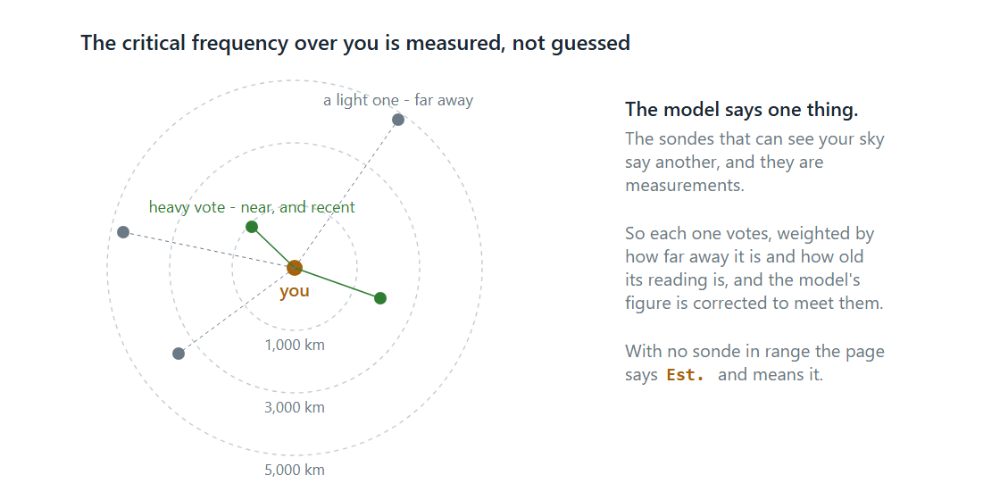

**The sondes that vote.** The critical frequency over you is the model's figure corrected to meet the sondes within five thousand kilometers, each with a vote weighted by its distance and by the age of its reading. The line under the numbers names them, marks any whose reading was held from an earlier fetch after the feed missed a cycle, and says how far the correction would move if any one of them dropped out. That last figure is the one to read when two units side by side disagree: a thin panel far from the nearest sounder can swing by a third on one vote, and the page now says so instead of leaving two screens to argue. The weekly field report, if you have switched it on, carries how steady the panel was over the week and nothing that names your station.

### Calibrate my forecast

**What it is for.** ELMER's forecast knows the sun and the flux. It does not know that the F layer over your town runs denser on a winter noon than the sun angle says, or by how much, and that error is different at every latitude. Calibrating measures your own, and makes every forecast this unit gives you more accurate from then on. It is the single biggest thing you can do to improve the band plan's verdicts and the reach map, and most people never need to do it more than a few times a year.

**Before you can run it.** Set your QTH first, at the top of the Propagation page. The forecast is about a place and so is its correction, and the button will tell you so rather than run on a guess. You also need a network for the first minute or so, while it fetches the record. Run it from the unit's own screen: a phone on the table cannot start it, because it is this unit's processor doing the work and this unit's table at the end of it.

**Where it is.** At the foot of the **Propagation** page, under the wall chart.

**How long, and what you see.** About five minutes on a Raspberry Pi. You are not left looking at a frozen screen: it reports what it finds as it goes, a month at a time, with a card or two in between, and you can stop it.

**What it actually does.** It fetches the last year of readings from the ionosondes nearest you, then runs ELMER's own forecast blind across that year, hour by hour, each hour given only what it would have known at the time. It compares every one of those forecasts against what the sondes actually recorded, and fits a correction month by month and sky by sky. Then it runs the whole year again with the correction switched on, so you can see what it bought. The line it prints at the end is the plain answer: the 24-hour forecast's average error before, and after, in megahertz, with "same as yesterday" beside it for comparison.

**Do you have to apply it? No.** The correction is saved when the run finishes and every forecast this unit makes for this place uses it from that moment on.

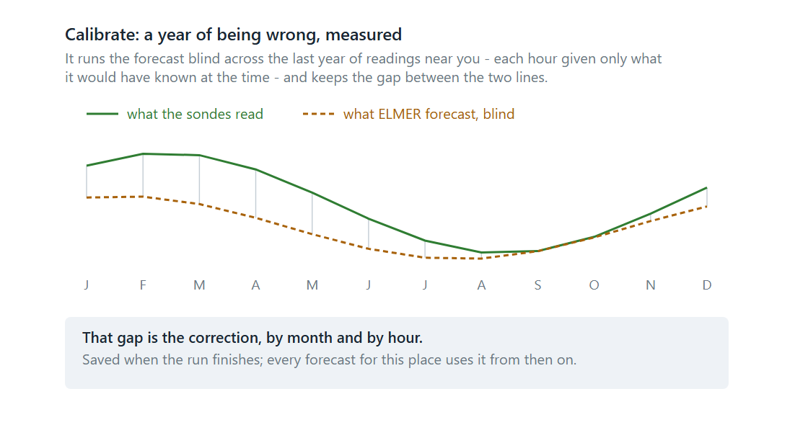 There is no switch to throw and nothing to accept. You will see it in the band plan's hour-by-hour verdicts, in the reach map and in the propagation outlook, without doing anything else.

**Choose a depth.** A quarter, a half year or a full year. Each depth refreshes the months it actually covers and leaves the rest exactly as the last run that saw them measured. So a quick run in September sharpens the autumn and leaves December standing on the full year you ran in the spring. Deeper is better and slower; the year is the one to run first.

**When to run it.**

- Once, after you set your QTH for the first time. Until then the forecast carries a general correction rather than yours.
- Again when you move the station far enough to matter. The correction is fitted for a place and its weight falls away with distance, and past five thousand kilometers it is a different ionosphere and is not used at all.
- Every few months, as a quarter run, to keep the current season measured on recent sky. There is no harm in running it more often and no benefit in running it daily.

**When it cannot run.** If the archive it needs is unreachable it says so in plain words and stops. Nothing is wrong with the model then, only the network. It waits out a server that is merely busy, and where one source is down it takes the flux from the observatory at Penticton instead. If the record covers less of the year than it should, it shortens the span to what it actually has rather than forecasting a year from one number.

**What leaves the unit.** Nothing. It reads the public record from GIRO and GFZ and keeps the result here.

## The band plan

What the law allows, and what convention puts where. Pick the **license class** at the top, or enter your callsign in the strip below it and ELMER uses your actual privileges and tells you when the license expires. The page opens on the class you hold every time, whatever you were reading last. With no license on the station it opens on **No license**, which is the true answer: every amateur band reads no, and under them are the services that are yours today and the exam that opens the first of the others. The picker changes only what is on the screen: reading a class above your own is the point of having it, and it is how you decide whether the upgrade is worth sitting for, so a class you do not hold brings a note saying so rather than a locked door. What it is not is a claim. It does not tell the rest of ELMER that you hold that class, and it does not open a study pool - the pools follow your license, and your license is set with your callsign or on the setup page. Each band is a button; the chosen band shows its bar colored by activity, with the parts your class may not transmit on hatched out, the privileges for your class beside the rule that grants them, and a table of what happens where and whether you may use it in that mode.

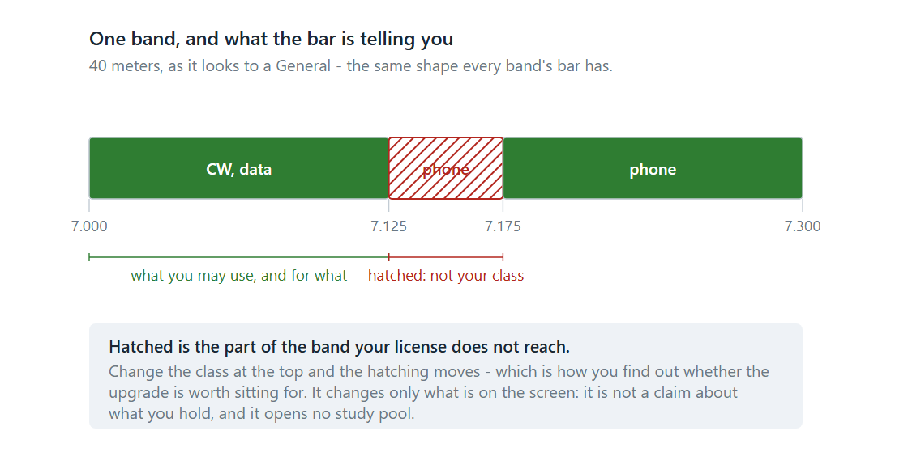

Every band has its own color, the same wherever its name appears in ELMER: on the buttons here, on the reach map, on the Lab's chips, in the propagation outlook and on the printed chart. The hues are ELMER's own, because nobody publishes a color a band. They used to run the spectrum in frequency order, which put the nearest colors on the bands hardest to tell apart and read as a flag rather than a set of things. Each band now has a color chosen so its neighbours are far from it, warm beside cool and light beside dark, the way a box of colored pencils is told apart, with no order in the hues meant to be read as anything. The eight bands everyone uses were checked against simulated red-green and blue-yellow blindness and stay distinct by lightness as well as hue. 11 meters is CB rather than amateur and is gray on purpose. The color is never the only cue; the name is always printed beside it.

**Visiting under reciprocity.** The last entry in the class list is for an operator here on a license from somewhere else. Under 47 CFR 97.107, somebody holding an amateur authorisation from their own government may be the control operator of a station in the US wherever a reciprocal arrangement reaches: CEPT, the IARP, or a bilateral one, and Canada's is written into the rule itself. Choose it and the chart draws what an Amateur Extra may do, because that is the ceiling the rule sets. It is a ceiling and not your privileges: what you may do here is the terms of your own license and the FCC's rules together, whichever is narrower, and ELMER has never seen your license. The note beside the chart says that, and how to identify under 97.119(g) - a Canadian licensee puts the US call sign area indicator after their own call, everybody else puts it before. None of it applies to a US citizen or to anybody already holding an FCC license.

It is a view and not a class. It cannot be set as your license in the Station panel, it opens no study pool, and it does not print, because a sheet headed "visiting" with a callsign on it would read as a claim about your authority in a country whose license you do not hold. The Amateur Extra chart is the same ceiling and prints as it always did.

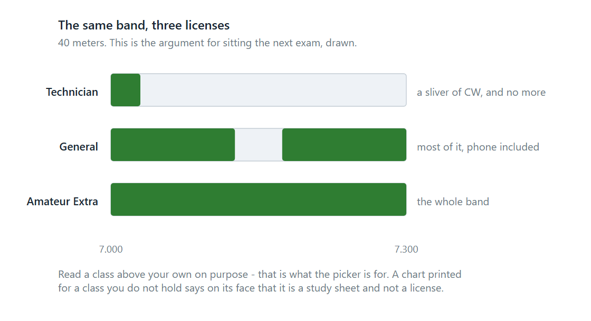

**Regional coordinator.** The local frequency coordinator's plan, fetched from their site and drawn beside the national one. With a QTH set, the coordinator for your state is picked on its own.

**Where the band reaches from here, now.** For the HF bands, a map of the world in the band's own color, bright where the band is good from your QTH at this hour and dark where it is shut, with the night side shaded and the terminator as its twilight. Drag to look round, use the wheel, a pinch or a double tap to zoom in, and the model is asked again for that window in finer detail. It is a model from one sounder's reading and it is labelled as one; what it is right about is the shape. Choose one way or the round trip, and which borders to draw.

**Zoom and detail are two different things.** The map zooms to twenty-four times, and the corner of it says how far in you are. The detail comes in steps as you go: the whole world is a five-degree grid, and a zoomed window is asked for again at two and a half degrees, then one, then a half at six times, then a quarter of a degree from twelve times on. Past twelve times the picture keeps growing but the cells do not get any finer; a quarter of a degree is about seventeen miles north to south, and that is the end of the detail on purpose. The map's physics is a hop off the ionosphere read at the middle of each path, and the ionosphere does not change from one town to the next, so finer cells would cost the unit time and show the same picture. Where the ground itself decides, at a few miles on VHF, the tool that answers is on Make Contact, below.

**Two antennas, two questions, one map.** The panel under the map takes your antenna, its height, which way it is laid and the ground it stands on, as the Lab remembers them, and the map is weighted by the angle each path leaves at and what that antenna puts there. The **NVIS** switch sets a wire a fifth of a wavelength up, where the ground's reflection adds most straight up, and brings the map in round the station; the line under the map then says whether this band comes back from overhead at all, from the critical frequency over you. Every cell on the map is rated against its own hop's ceiling: straight up that ceiling is the critical frequency itself, at three thousand kilometers it is the sonde's own M(3000) factor times it, and the layer's shape carries the curve between - so the county at noon on 40 meters is rated as the county, crossing the absorbing layer once and nearly straight, and not as a long path. The antenna's weighting keeps the ground's real gain: a wire a fifth of a wave up is credited the reinforcement overhead, and the same wire half a wave up is charged the dip there. The map's colors run out near the top, so a line under it says the height's effect in numbers: the wire's height in wavelengths on this band, and its gain against a dipole in free space straight up, at 45 degrees and at 20 degrees, with its best angle - a quarter wave up reads some four decibels of reinforcement overhead, half a wave up a seven-decibel dip. **The watts and the mode** beside them decide one thing only: the ground wave, the part of the signal that crawls along the surface and fills the hole inside the skip. A narrow mode hears deeper into the noise, so CW carries further than SSB and FT8 further than CW; AM is the widest, and its watts are the carrier. The sky does not care what is modulated onto it, so the rest of the map is the same whichever you choose. On 11 meters the panel holds to the law: 4 watts of carrier on AM or FM, 12 watts PEP on SSB, no CW or data, whatever was in the box, and the note under the map says so.

**The charts.** **One page (PDF)** prints a single landscape sheet with your privileges filled in and colored by what you may do; **Full chart (PDF)** prints the whole plan band by band. Both land on the Printouts shelf and open in the viewer. A chart printed for a class you do not hold says on its face that it is a study sheet, not a license.

**The other radios in America.** FRS, GMRS, MURS and CB, the Part 95 services, with their channels and the rules cited, because most two-way radios in the country are not amateur radios. And the **NIFOG**, the national interoperability field guide, with the caution that nearly nothing in it is amateur spectrum: monitor freely, transmit only where you are licensed to.

## CW

Learn it, copy it, send it, and decode what is coming out of the receiver. The settings bar at the top is always in view: tone, volume, character speed and effective speed. The tone starts at 1020 Hz, the pitch aviation identifies in code on: ICAO gives VOR, ILS and NDB stations 1020 Hz for their idents, and the TONE switch on a military UHF set keys 1020 Hz for a direction-finding steer. Put it wherever you hear it most comfortably, anywhere from 300 to 1200 Hz, and it is remembered. The volume is ELMER's own and sits under the system volume, and it starts most of the way up, because a unit wired to a monitor with no volume button of its own has no other way to be heard. The two speeds are Farnsworth timing, characters sent fast with the gaps stretched, so you learn the sound of a letter at the speed you will eventually copy it.

The row of buttons across the top is the page: **Next session**, **Learn**, **Chart**, **Copy practice**, **Send text**, **Your sending**, **Your rating**, **Qualifying run** and **Decode off air**. Nothing on this page needs a network.

### Next session - the door

Your record decides the lesson and one press runs it. The panel says which lesson you are on and how many of the forty characters are solid, draws the characters you have met colored by how they are going, names anything new, and says what is still shaky and what it is being heard as - "Still shaky: R (heard as K)" is the most useful line on the page, because the confusion is the work. Under that is the session itself, listed in order with a clock against each part: meet what is new, one character at a time, groups of five, words once there are any, and a lap on something you already have to finish on. After each key a chime or a buzz, and if you tick **say what was sent**, the phonetic name of what it was. In the one-at-a-time drill, press **?** (or the Resend button under the card) to hear a character again before you answer; the clock keeps running, the way a contact's patience does.

The button says **Next session** and not *Today* on purpose, and the change of word is the change of idea: it is the next pass through the lesson, not a box that has to be ticked before midnight.

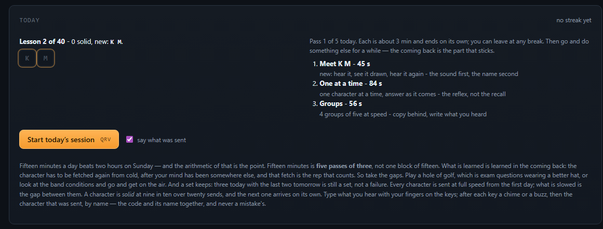

### How long a session is, and why it is short

Fifteen minutes a day beats two hours on Sunday, and the arithmetic of that is the whole point: fifteen minutes is five passes of three, not one block of fifteen. What is learned is learned in the coming back. The character has to be fetched again from cold, after your mind has been somewhere else, and that fetch is the rep that counts - it is the same trick as using a new acquaintance's name three times in one conversation, spaced out, rather than fifteen times in a row. A drill that never stops is not five reps of the same thing; it is one long one, and what a learner takes from the eleventh minute of K and M is not K and M. It is that this is a thing to be endured.

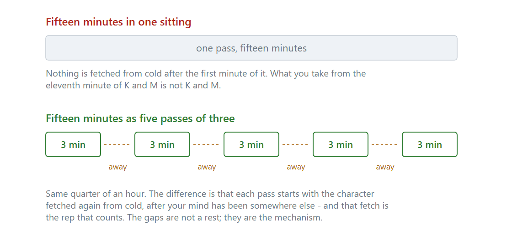

So the session is clocked from the material there is to hold. Two characters is three minutes - long enough to get measurably quicker at them, short enough to leave you wanting the next go rather than relieved it is over - and it grows by about seven seconds for each character you earn, to six minutes with the whole order in hand. What it never becomes is a quarter of an hour in one sitting.

**Five is an illustration, not a quota.** The arithmetic above is why the sessions are short, and that is all it is: ELMER counts the passes you have done and never the ones you have not. The line under the session says "Pass 3 today - 2 done so far", the count goes up rather than down, and nothing is ever outstanding. Somebody studying for an exam in three weeks and somebody learning the code because they feel like it are both using this correctly, and a program that told the second one they were two passes short of a day would have misread them both. At the end of a pass the card says what you did and sends you somewhere else for a while: a hole of golf, which is exam questions wearing a better hat, or the band conditions, which is the argument for going and getting on the air. Start another straight away if you want to. Nothing here expires and nothing is owed.

### A set of passes does not expire at midnight

Passes done on one evening and passes done the next morning belong to the same run of work, and ELMER treats them that way. Somebody who got three in before the evening went sideways has done three; the next morning picks up where that left off rather than wiping it and starting again, which would be the program punishing them for having a life. The whole argument for this shape is that it fits into the gaps in a day, and a version of it that only works on a clear day is not the same claim.

So a set carries. It stays open for the day after the one it was opened on, and a pass finished inside that window goes on the same set; past that it is a new set, because a set that never closes is not a set either. Tomorrow can still count as today. A set that gets finished stands for the rest of the day it was finished on, and a pass after that opens a new one, because more is welcome and none of it is required.

### Both ends of the range

A set can be a couple of hours or a couple of days, and both are ordinary. The chance of anybody hearing the whole code and recalling it on the first day is infinitesimal - and somebody who does get through it in a day and still has it the next morning is rare and is not to be held back for being rare. The same record serves them and the learner who has been on the same five letters for five days, and it serves both by measuring the one thing that tells them apart, which is the next section.

### Cold and warm, and sleeping on it

A rep is **cold** when at least a minute has gone by since you last answered that character - the first one of a sitting, with nothing warmed up in front of it - and **warm** otherwise. They are the same entry in most records and they are not the same evidence. This is how a dog is judged on "sit": not the tenth in a row with a treat already in the air, but the first one of the walk. That rep says the expectation is achievable from cold, and it is the one that earns the fuss.

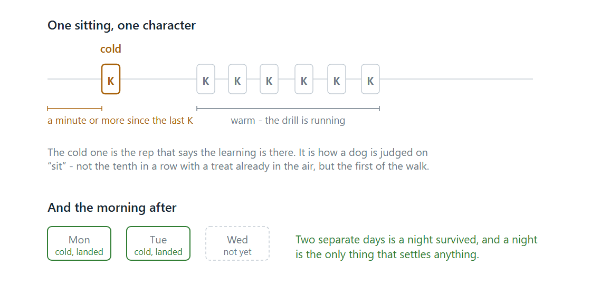

The card at the end of a sitting is ordered by that and not by what a scoreboard would pick. Loudest is a character named cold for the first time, however roughly - gross replication, the dog sat - because that is the rep that sends somebody back for more. Reliability comes next and quieter: "K lands cold now - 4 of the last 5 first-of-the-day tries, where it used to be hit and miss". The refined state comes last, is rationed to two lines, and is read off the cold rep rather than the tail of a warm drill: "K cold: 2.6 s when you learned it, 0.9 s now". Weighting it this way round looks upside down next to a leaderboard, and it is deliberate - a reward that keeps arriving for the polished thing teaches you to perform for the reward, and then the reward is the subject.

Above all of it sits the one measure that settles anything. The record keeps which days each character was named cold and landed, for the last fortnight, and **a character that is there again on a later day has survived a night**. Hearing it today proves the ear works; having it tomorrow is the learning, and that is the loudest line the card has. It is also the line that answers both ends of the range at once, without flattering either: the learner who tore through the order in an afternoon is asked the same question the next morning as the one who is still on five letters.

The other side of the same count is said too. A character met cold on four separate days that still has not settled is named, with what it is being heard as - "M has been coming round for 5 days and has not settled yet - it is being heard as S". That is normal and it is not a verdict on you; some characters take a week. What shifts it is hearing the pair against each other rather than more of the same one.

And within a sitting, the session watches your reaction times and compares the last few against your own best stretch earlier in the same session - your best today, not anybody else's, so a slow day is not read as a decline. When a sitting has gone past its useful end it says so and offers the stopping point, because the last five minutes of a tired drill teach the wrong thing.

### Learn - the Koch method, one character at a time

**Learn** is the Koch method: two characters at full speed, then one more at a time when the ones you have are solid. The lesson's characters are drawn as shapes to compare against, and below them is a grid of where you stand on all forty, green for solid, amber for shaky, red for needs work, gray for not met yet. Hover a character for what it was confused with, and how often it had to be sent again. The slider sets the copy drill; the one-at-a-time lesson follows your record and cannot be pushed by it.

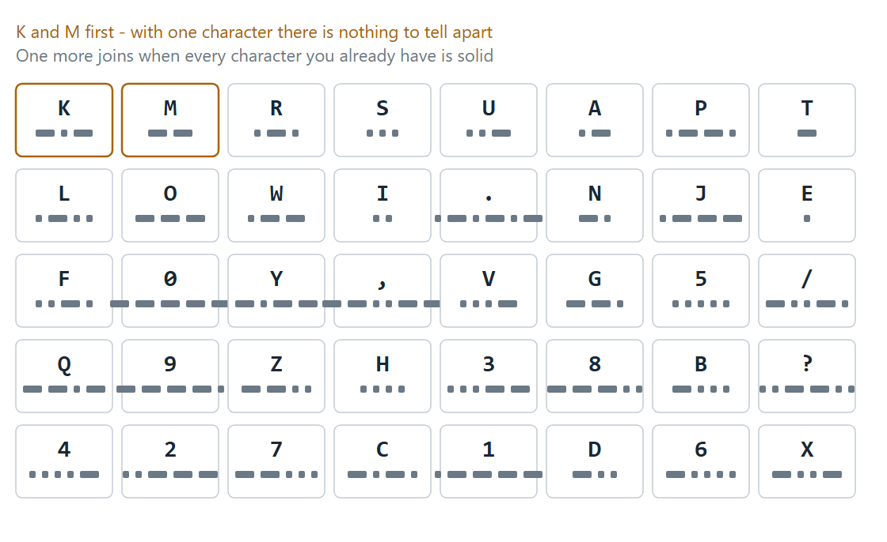

**Learn them one at a time** is the place to start, and there is no clock on it. It begins with two characters, K and M, because with one there is nothing to tell apart. A character you have never heard is met first - it sounds, it is drawn, it is named - and nothing is asked; that is you finding out what it sounds like, and it is not a test. Then it joins the drill: one character sounds and nothing happens at all until you answer. Compare what you heard against the shapes above and pick the one you think it was, by clicking it or by typing it; ask for it **Again** as often as you like first.

Your answer goes up on the screen in green if it was right and in red if it was not, and either way the character that was actually sent is named aloud. Hear K, pick K, and a green K appears and Kilo affirms it. Hear K, pick R, and a red R appears and Kilo tells you what it really was. The name you hear is never the mistake, so the sound of a character is only ever coupled to its own name. Miss it and the same character comes round again.

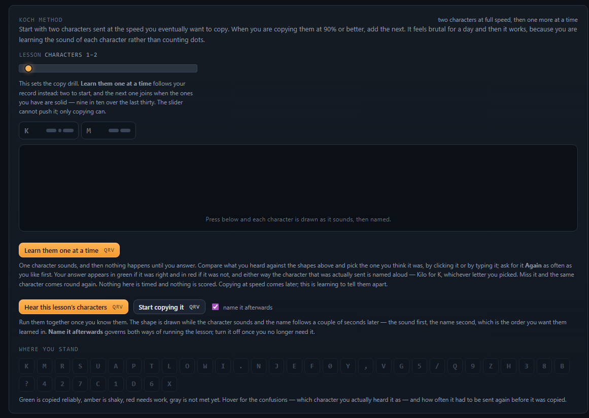

Every answer goes into your record, and the record decides when you are ready for more. A character is **solid** one of two ways: nine in ten copied over your last thirty sends - the last thirty, not everything ever, so a rough first day with a character is forgiven once you have it - or twelve clean in a row with at least one of them named cold, which is the shorter road for somebody who simply knows it already. When every character in the lesson is solid the next one in the order is met and joins, and the lesson says so. How often each one comes round is set by how much work it still needs: the newest most, about four times as often as one you know; every shaky one more the shakier it is, so a character you copy half the time comes round about three times as often as one you have cold; and the ones you know least of all, but never never, because what is known has to keep being asked or it stops being known. On top of that, a character you have just missed is put back in the air within the next few sends, whatever the deal would have drawn, while the miss is still warm. Nothing is ever taken away - a character slipping does not shrink the lesson behind it - and not advancing is the lesson's way of saying not yet. The counter under the buttons shows how many you have heard this sitting and how many of the forty are solid.

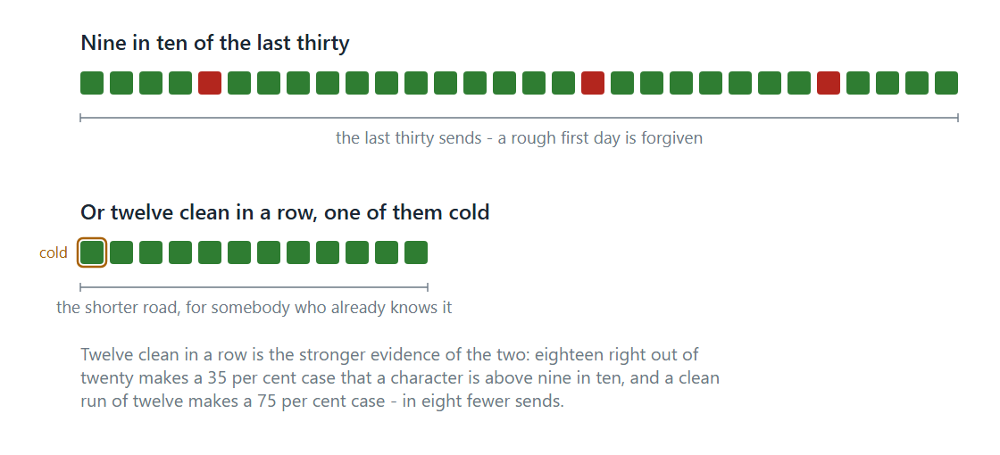

The drawn shape comes down once a character is known by ear. It is how a character is met, but during a drill it can be read off the screen while it is still sounding, and then the answer comes from the eye - fluency at a thing nobody does on the air. So it comes down after four clean copies running and goes back up if copy falls away, and the session says out loud when a shape has come down, because a screen that quietly stops drawing looks broken to the person it is helping.

It is a slow build on purpose. The drills upstairs are for speed; this is for knowing the sounds, and nobody who copies at twenty got there any other way.

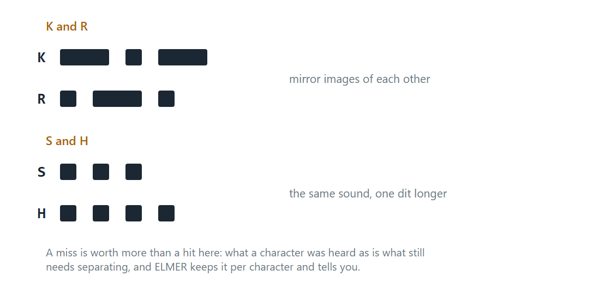

**Hear this lesson's characters** runs them all together once you know them, each named a couple of seconds after it sounds. The button becomes **Send them again** afterwards. **Start copying it** is the next step up. **Name it afterwards** governs the naming in both, and you turn it off when you no longer need it.

### Chart - the whole code on one wall

**Chart** is the whole code, click anything to hear it, with the dits and dahs drawn to length and the prosigns run together. A dah is three times a dit and the gap inside a character is one dit, which is what the spacing shows; a space in a code is the gap between two letters, drawn as silence of the right width and sounded as silence of the right length. That is the whole difference between the Q signal QRM, which is three letters, and a prosign, which has no gaps inside it at all and is one sound.

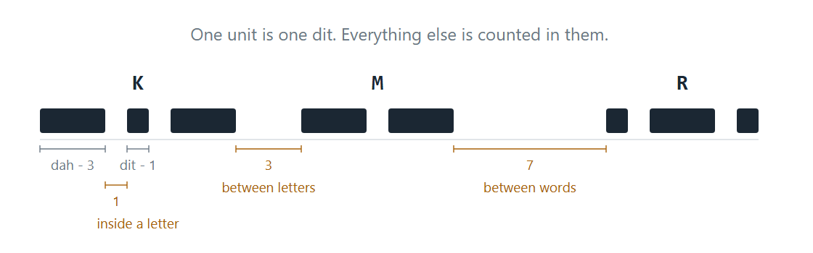

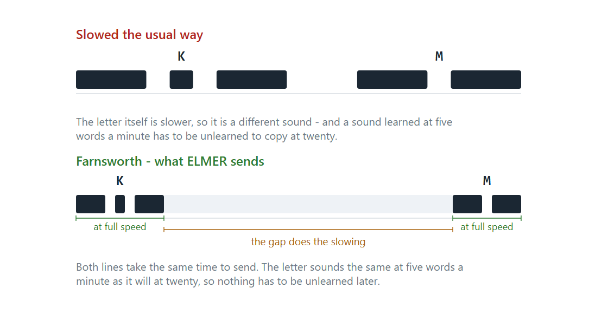

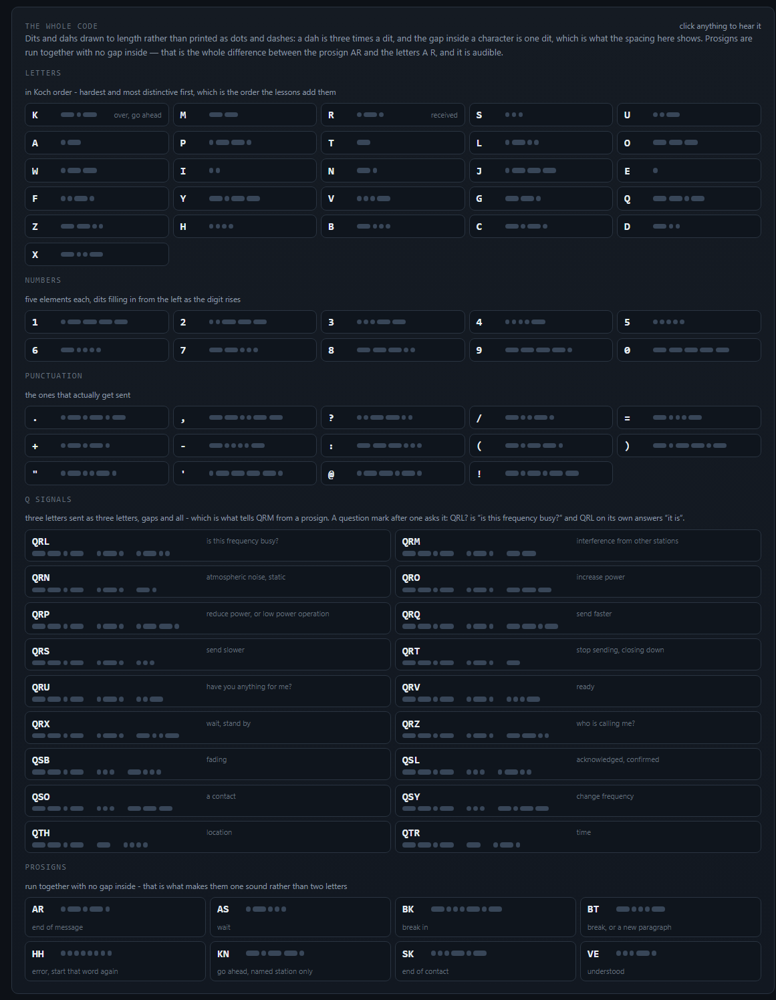

### Qualifying run - when you already know more than the program does

Somebody who already knows the code - a tester who reset their profile, an operator coming back after twenty years - should not have to earn forty characters one at a time for letters they copied before this program existed. **Qualifying run** is the way past it, and it is the old code test rather than anything invented here.

You name the speed you think you can hold, anywhere from 5 to 40 words a minute, and the line under the slider says what that speed is for before you commit five minutes to it. Then the run: five minutes of real traffic - plain words, callsigns with the odd `/P` and `/M`, Q signals, three- to five-figure serials, punctuation - sent at the speed you named, with one contiguous minute of it copied without a miss as the bar. The clean stretch is shown as it grows rather than sprung on you at the end, and a scrambled first half minute is not held against you, because the stretch that counts is the best one anywhere in the run and that is what settling looks like.

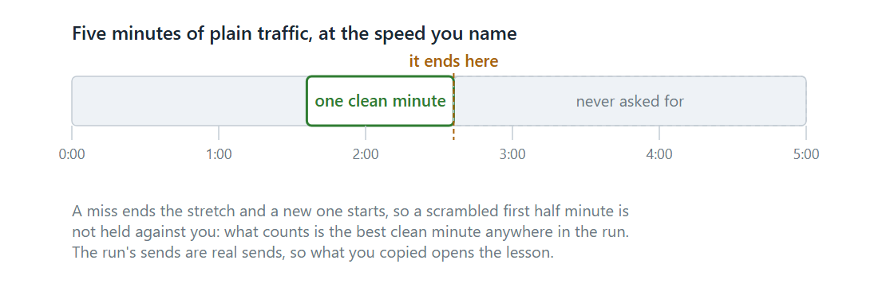

It ends the moment the minute lands. Making somebody sit through four more after they have proved the thing is the program collecting evidence for its own sake. What was copied counts: the run's sends are real sends, and the lesson opens to what you met and copied, so a returning operator drills the alphabet instead of crawling out of K and M. Being solid still has to be earned - five minutes is not twelve clean reps of forty characters at any speed - and what you did not copy is not credited.

Nobody is told they failed. Reach too high and you are given the speed the run just measured for you, and told that the copying was real. Turn out to be somebody whose characters are not there yet and you are told that plainly and sent to the place they are learned, with a horizon on it. Stop it early and you still get a verdict and something to do next.

The shape is not ELMER's. Chuck Adams, K7QO, describes the standard for code tests and world records as copying one minute without error out of five minutes of plain text; the [ARRL's write-up of his 140 words a minute](https://www.arrl.org/news/morse-code-at-140-wpm) is where both that and the caution about the figure itself come from.

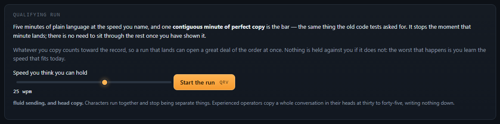

### What a speed means

A number of words a minute is a number until you know who is up there, so ELMER keeps one ladder and reads from it wherever a speed is chosen or measured - on the qualifying run's slider, and against your rating.

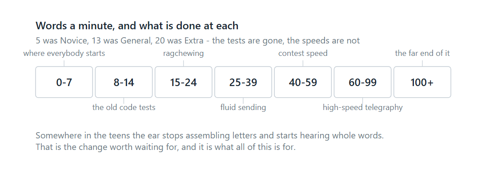

- **Up to 7** is where everybody starts. Every character is sent at full speed from the first day; what is slowed is the gap between them. Nobody learns the code slowly and then speeds it up - that has to be unlearned.
- **8 to 14** is the old code tests: five words a minute was Novice, thirteen was General, twenty was Extra. The tests are gone and the speeds are still where most conversations live.
- **15 to 24** is ragchewing, and somewhere in here the ear stops assembling letters and starts hearing whole words. That is the change worth waiting for.
- **25 to 39** is fluid sending and head copy. Characters run together and stop being separate things; experienced operators carry a whole conversation in their heads at thirty to forty-five, writing nothing down.
- **40 to 59** is contest speed - callsigns and reports in bursts, usually with a keyer driven from logging software. Hands on paddles can burst into the fifties; holding it is another matter.
- **60 to 99** is high-speed telegraphy, copied continuously at rates that rival ordinary typing. Sending this fast is machine work: past about seventy it is software, for spacing no hand can hold. There is a [world championship for it](https://www.iaru-r1.org/2024/20th-iaru-hst-world-championship-tunisia-2024/), run by the IARU.
- **100 and up** is the far end. The callsign record is held by Ianis Scutaru, YO8YNS, who took [RufzXP to 311,192 points](http://www.highspeedtelegraphy.com/Telegraphy-world-records/World-record-Rufz) at 1,126 characters a minute - about 225 words a minute - at the IARU world championship in Tunisia in 2024. Single callsigns, not prose, and a program that speeds up every time you are right.

Every rung with a claim in it carries a source you can follow, which is the point of a record being published. The figure that gets repeated second-hand - 140 words a minute of "plain text" - is wrong twice over: it came from RufzXP, which sends single callsigns and nothing else, and the holder himself says the plain-text framing is misleading. Worth knowing about; not a target.

### Copy practice and Send text

**Copy practice** and **Send text** are what they say. Prosigns go in angle brackets, `<AR>`, `<SK>`, `<BT>`. Copy practice counts down before it sends - 3, 2, 1 in the status line, with a soft tick each second - so there is time to get a hand from the mouse to the keyboard or a pencil before the first character. The tick is a click well above the tone and far too short to be taken for a dit. Press any key to start at once, or **Stop** to call it off. **Countdown** in the settings row sets its length, 0 to 5 seconds, and 0 turns it off. **Rate my copying** counts down the same way. Ask for a **Resend** as often as you need - a contact would - or **Slower** and **Faster**, which send the same text again two words a minute off or on the effective speed. The resends are counted beside the copy: "87% copied, after two resends" and "first time through" are different things to know, and the record keeps the count per character.

### Your sending

**Your sending** is a keyer: straight key, iambic A or B, a big hold-to-key button, and two levers you can bind to any keys - click the key label under a lever and press the one you want. A keyboard is a poor paddle, because most cannot report two arbitrary keys held at once; the Ctrls or the Shifts work, and so do the on-screen levers. A real paddle wired to the bound keys works best. The readout shows the element in the making while the key is down, a dit until it has been held long enough to be a dah. **Key from an audio input** takes a real key wired the way it is on the bench - through a SignalLink, a rig's sidetone on Line-In, or any USB sound device carrying a keyed tone - and works the straight key from the tone's coming and going, so the timing chart measures your fist on the bench. Pick the input once; it is remembered.

### Your rating

**Your rating** measures your copying and your sending in words per minute and keeps both with your account. The CW games set their level from it. Resends on the ladder are counted and said with the result, and the rung of the ladder above is named from the list two sections up, so a number that has just moved says what it is now for.

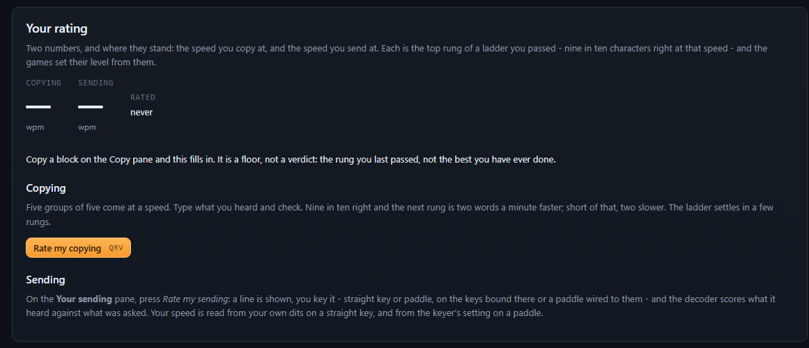

### Decode off air

**Decode off air** listens through the microphone and decodes what it hears. Point the microphone at the receiver's speaker; the page asks for microphone permission the first time.

### The buttons speak CW

Every control on the page is labeled the way a contact would put it and keys its code before it acts, with a card at the foot of the page naming it while it sounds: QRV go ahead, QRS send slower, QRQ send faster, QSM? please repeat, QSL received and understood, QRT stop. The sound, the letters and the meaning arrive together, which is how you come to think "QRS" when the code feels rushed - and that is the code learned. **Key the Q-codes** in the settings row turns the keying off once you are past needing it.

## EME

The moon, from a clock and a place, nothing fetched. Where the moon is from your QTH, whether the moonbounce window is open, and a map of the world showing who else can see it: drag the slider through the next four days and watch the window sweep, and click anywhere on the map for that place's opening and closing times. A QTH has to be set first, since a window needs both ends, and the page says so if it is not.

**Reading the map.** The colors are sky conditions and only that: green where both ends have the moon twenty degrees up or better, amber where the lower end is between eight and twenty, dark red where one end is under eight, cyan where they can see it and you cannot, gray where the moon is down. The symbols are things, not conditions: a circle is you, a diamond is the spot you clicked, and the moon and sun glyphs are the points those are directly overhead. Beneath it, what the numbers mean: distance, which is about two decibels between perigee and apogee, declination and the sky noise behind it, and separation from the sun. The meteor calendar is here too, with the showers and what they are good for. Point a dish with a real ephemeris; decide whether to bother tonight with this.

## The Lab

**What it is for.** The maths the exams ask about, made movable, plus the station knowledge the exams only gesture at. Nothing here is a quiz. You change an input, watch what the formula actually does, and then go and drill the section that asks about it, and the reason to do it in that order is that a formula you have watched move is one you stop having to memorise.

**Nothing here needs a network** except where it is said. The defaults on the hop tool come from the nearest ionosonde when there is one, and the path tool fetches terrain when it can; everything else is arithmetic done on the unit.

### Ionospheric hop - why a band opens, and where the skip zone falls

Put in a band or a frequency, and the critical frequency and layer height, which arrive filled in from the sounder nearest you when there is a network. Out comes a drawing of the rays: the ones that bend back to earth and the ones that punch through and are gone, with the skip zone marked between where the ground wave stops and the first hop lands. Reach for it when a band is open to somewhere far away and dead to the next county, which is the thing the picture explains in one look.

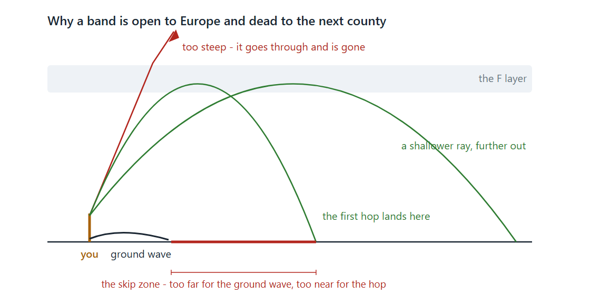

### Ohm's law and power

Fill in any two of volts, amps, ohms and watts and press **Solve** for the other two. **Clear** empties it. It is the tab to keep open while working the electrical questions, because the exam asks the same relationship a dozen ways.

### Reactance and resonance

Frequency, inductance and capacitance, and a plot of how the reactances cross. Use it to see why a circuit is resonant at one frequency and not another, and why the two reactances cancel there.

### SWR, reflection and what it actually costs you

Line impedance, load impedance and transmitter power. It answers the question the exam never quite asks plainly: what a standing wave ratio actually loses you in watts, which for a mismatch that sounds alarming is often less than people expect, and for a long lossy line is more.

**What a tuner does about it.** The tab says, as the number changes. Three to one is worth remembering twice over: it is about where a radio's own circuitry starts pulling the power back to protect the finals, and it is about as far as the tuner built into a radio will reach - some are narrower. An outboard automatic tuner usually goes to around ten to one, and a manual one further still. What a tuner buys is that the radio sees 50 ohms and stops folding back, so it delivers its full output again; that often puts *more* power into the antenna than running untuned did, not because the antenna improved but because the radio stopped defending itself. What it does not do is change the standing wave between the tuner and the antenna - that length of line still carries it, and still pays the loss - and it has a little loss of its own. A match at the rig is not an efficient antenna: a perfect 50 ohms can be a tuner matching into a loading coil that is mostly heater.

### Antennas - dimensions, impedance and gain

The long one, and the order of the questions is deliberate. It starts with what you have got to work with, which is a mast, a garden, an attic, a balcony, a vehicle, or nothing at home at all. Then what you want to do with it, the frequency, and the power you will run. Then the antenna itself, its height, its slope and its droop.

- **Evaluate this setup** draws it: the radiation pattern, what the height is doing to it, the feedpoint impedance, and a reading in words of what the setup is good for and what it will disappoint you at.
- **Not sure, suggest one** picks an antenna for the answers you have already given, which is the button to use the first time.
- **Print the sheet (PDF)** puts the whole evaluation on the Printouts shelf, to take out to the garden.
- The sliders that turn the picture sit under the plot they move, so you can see the pattern change as the height does.

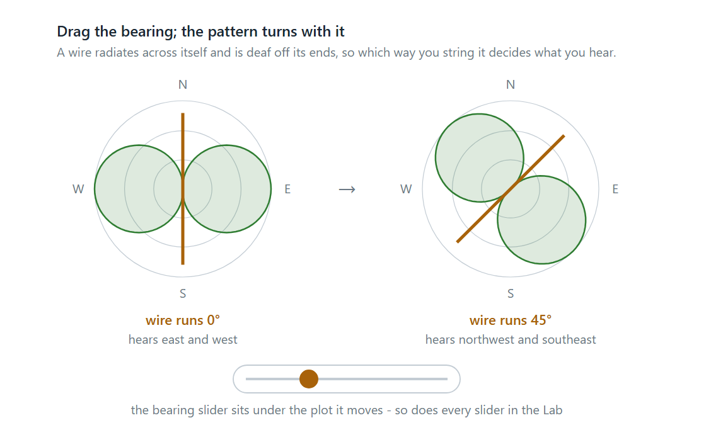

**Reading the two plots.** **Looking down on it** is the view from above - which way the antenna hears, with real bearings on it. **Elevation pattern** is the view from the side, and it is a slice through the whole vertical plane: the horizon the antenna faces on the right, straight up at the top, and the horizon behind it on the left. Most antennas have two lobes there and both are drawn. A vertical's pattern is a doughnut, the same in every direction round it, so from the side it is two lobes and from above it is a circle; a wire radiates broadside both ways, so its two lobes are mirror images and there is as much behind it as in front - turning a wire does not aim it, it moves the nulls off the ends. The one antenna whose two halves really differ is a beam, and that difference is the front-to-back you paid for. The dashed line is the takeoff angle, drawn on every lobe that is actually at it.

Both plots are over average earth rather than perfect ground, which matters most to a vertical. A vertical's own element is strongest out along the ground and nulls straight up, along its own axis - but real earth turns its reflection against the direct wave at grazing angles, so the field falls to nothing right at the horizon and the lobe sits twenty-odd degrees up. That is where the signal actually leaves, and it is what the reach ring under the plan view is measured from.

### Smith chart - what the feedline does to your antenna

Antenna resistance and reactance, the frequency, the feedline type and its length, and the power. The presets are worth pressing before anything else: a resonant dipole, a quarter-wave vertical, and then **Too long**, **Too short** and **Off-resonance**, which show you what each kind of wrongness looks like on the chart, so you can recognize your own antenna's fault later. **Use the antenna I designed** carries the antenna tab's result straight in, and a measured sweep from the VNA on the Tools page appears here when there is one.

### Decibels

A reference power and a resulting power gives you the decibels between them; a decibel figure works it the other way. Small tab, constantly needed.

### Path and line of sight - will this link actually work?

Both ends as a grid, a latitude and longitude, or a place name, with **use my QTH** and **locate me** to fill one end in. Then each end's height above ground, antenna gain and line loss, the frequency, the transmit power and the receiver's sensitivity. **Analyse path** gives you the terrain between the two, taken from a thirty-meter elevation model when there is a network, and says whether the link closes. Without a network it still does the smooth-earth arithmetic and tells you that is what it has done. This is the tool for a repeater you cannot hit, a simplex path across a county, or a link to the next building.

### Safety and grounding

Below the tabs is a bench: a short piece of writing with cards on it, and the exam questions that belong to each card gathered underneath, so reading about a thing and being asked about it happen in the same place. This one is the habits that keep a station safe, and it is the part of the Lab most worth reading even if you never touch a calculator.

The cards are **Ground, bonded** and the three grounds a station has; **Lightning** and arresting it at the entry; **The power line**; **Noise, and what the antenna keeps company with**; **The tower**; and **RF and the body**.

Two of those cards carry a calculator, and they are the two where getting it wrong is not a matter of a poor signal.

- **The power line.** Put in the height of the mast or antenna above its base and the distance from that base to the nearest power line, and press **Check it**. It tells you whether the thing can reach the line if it comes down. The rule it is applying is the one every tower manual states and most people guess at.
- **Noise, and what the antenna keeps company with.** A band or frequency and the distance to the nearest conductor or noise source, and **Where is it** says what that proximity is doing to you. Use it before blaming the radio for a noise floor.

## Tools

**What it is for.** The instruments, and the knowledge of instruments. The Lab is the material the exams ask about; this is everything else a bench needs, including two benches of written cards with the pool questions gathered under them, the same shape as the Lab's safety bench.

### Analysers and detectors

What each instrument can and cannot tell you, which is the part nobody writes down: **The SWR meter, the one you already have**, **The antenna analyser**, **The field strength meter**, **The RF sniffer and the RF probe**, and **The spectrum analyser**. Read it before buying the second instrument.

### The meter

A multimeter at each point of a station and what it ought to read there, with the arithmetic beside it: **Volts at the supply, volts at the radio**, **The fuse**, **Coax, connectors, and the dummy load**, **The battery**, and **Measuring safely**. It is the fastest route from "the radio is behaving oddly" to a number that says why.

### RF exposure evaluation

**Every amateur station has to deal with this, and most people are not sure how.** Since 2021 the blanket exemption amateurs used to enjoy is gone. Your station either qualifies for an exemption under the current rules or you evaluate it, and either way you have to operate within the limits in 47 CFR 1.1310. Put in the bands you actually run, with the antenna, its height and the power, and ELMER does the arithmetic and produces a station record.

**What you must do with the result: nothing.** This is the part worth knowing rather than guessing at, because the obligation is smaller than people assume and the rumours run in both directions. The rule requires that the evaluation is done and that the station complies. It does not require you to file it with the FCC, to post it in the shack, or to keep it at all. There is no form and no submission.

**Keep it anyway, and a file is fine.** If a neighbour complains or an inspector asks, the difference between a short conversation and a long problem is being able to show what you worked out and when. Because nothing prescribes a form, the sheet on this unit is as good as a sheet pinned to the wall, and far easier to redo. So no, you are not out of compliance for keeping it digitally, and you would not be in compliance merely by pinning it up either: compliance is the station being within the limits, not the paperwork.

**Redo it when the station changes** - a new antenna, a different height, more power, or a band you had not run before. That is the moment the old sheet stops describing your station, and it is the only moment any of this really matters.

The sheet goes to the Printouts shelf, where it can be printed or opened again later.

- **VNA.** A simulator for learning what a sweep looks like, and the real instrument: **Look for a VNA** finds a NanoVNA on a USB port, **Sweep it** reads it, **Export .s1p** saves the sweep. Calibrate it one standard at a time, and calibrate at the far end of the coax you will use; the page has the drill folded under a heading.
- **Sextant.** A sun sight when nothing else knows where you are. What one looks like and what you see through it, then the sights table: reading, time, limb. It needs the time to be right; four seconds of clock error is a nautical mile of longitude.
- **RF exposure.** Since 2021 every amateur station must evaluate its RF exposure and be able to show the result. Add a band, the power, the antenna and the distance, press **Evaluate**, and **Station record (PDF)** writes the record for the Printouts shelf.

There is a panel at the foot of this page headed **Developer, reset this unit**. It is for the author's bench, it only works from the unit's own screen, and it is not undoable. Leave it alone.

## Make Contact

Getting a message out: everything worth trying from where you are, best bet first, with what you actually have on hand. Tick the radios you have, a handheld, a mobile, an all-mode rig, HF with a whip or with room for a wire, GMRS or FRS, MURS, CB. The boxes are pre-ticked from the manuals on the Library shelf, and the page says so. Choose the license class and press **What can I reach?**

With a QTH set, the answer is local: the repeaters within reach and the bands open now. Type a callsign, a grid or a town into **Reaching somewhere in particular?** and the path tool works out how to get there, asking the same question for three license classes so it can say what the far end needs. Below the answer, **Getting on the air, your track**: the steps to a first contact, each saying how, how you know it worked, and what to do when it does not, with a box to mark each one done. The day of a first contact is one people remember, and ELMER keeps the date.

**By the numbers on VHF and UHF.** The path answer says whether the ground clears between the two ends, and past the horizon that it does not, which is true and is not the whole answer: a 2 meter signal does not stop at the horizon, it loses so many decibels getting past it, and whether the contact is made is whether the radios have those decibels in hand. So under the path there is a link budget. Pick a radio at your end and one at theirs off a shelf that runs from a handheld on its own rubber duck, through a mobile, to a base rig into a Yagi thirty feet up, then the band, the mode and how noisy the receiving end is, a quiet field or a residential street. ELMER adds it up the way a link budget is always added up, both directions: what leaves, what the path costs along the terrain between, what arrives, what the receiver needs, and the margin. The margin becomes odds, because real paths scatter about a figure like this by some eight decibels: twenty in hand is near certain, none is a coin toss, and minus ten is a long shot you may still get on a good day. When the odds are poor, **the step up** names the smallest change on the shelf that would make it, or says plainly that this one wants a repeater between or height at one end.

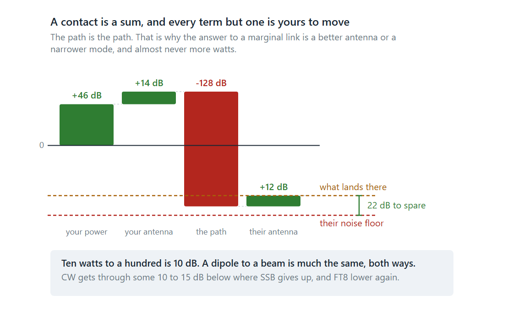

**By the numbers on HF.** Pick an HF band in the same panel and the question changes, because the ground between you is not the path any more: the signal leaves at an angle, turns in the ionosphere and comes down. Two things decide it, and they have different owners. Whether the band comes back at all over this distance is the ionosphere's - the critical frequency and the layer height read at the middle of the path, the same reading the bands line above runs on. No power changes that: above the MUF a kilowatt goes through to space the same as five watts, and inside a band's skip zone nothing lands however loud. Whether what comes back can be *copied* is yours: the watts you type in the **HF power** box, the mode, and how noisy the far end is. ELMER adds that up the way it adds up the VHF budget - what leaves, free space over the ray as it really travels, the D layer by day, a ground touch for every hop after the first, what arrives, what the mode needs above the noise - and gives you the margin. Fifteen decibels in hand is solid through the fading a skywave path always has; five is workable; nought is the edge. Where it is short it says by how much and **what power would close it**, or, when that would be past the legal limit, the honest advice instead: wait for dark, because the D layer has it by day, or use a mode that hears deeper - CW copies about fourteen decibels below SSB, FT8 about twenty-eight. The power box is the one box for the whole page: the list of bands that carry the path changes as you change it, which is the point.

**The path drawn.** Under the numbers, the ground along the path from the thirty-meter elevation model, the line between the two antennas sagging with the curve of the earth, and the first Fresnel zone as a band about that line, which is the width of clear air the signal wants. The worst of the ground is marked, red where it stands above the line and green where the path clears at its tightest, and a hover reads the ground, the line and the clearance at any point. The vertical is stretched, feet against miles, and the picture says so. The zone on 2 meters is hundreds of feet wide at a few miles, so where it is wider than the hills it runs off the top and bottom of the picture, which is the point: the ground is inside it. This is where finer detail than the reach map's lives, and it is the reason the reach map stops where it does.

## Parks and summits

POTA and SOTA, the two programs that give a portable outing a reason. Almost every wasted trip is a planning failure rather than a radio one, and that is fixable at a table days early, for nothing.

**Within a day's drive** fetches the parks and summits between two distances of where you are, or of somewhere you type, and **Print nearest** puts the list on a sheet for the Printouts shelf. **One park or summit** looks one up by name or reference and shows what the people who went there actually did: which bands, which hours, what they said. **What counts** quotes each program's rules, **Whose land it is** quotes the regulations, and **What you would be carrying** judges your gear against each program: a vehicle whip is a park antenna and a disqualification on a summit. Neither program can give you permission to be somewhere.

## Printouts

Everything this unit has built as a PDF, kept here so it can be read and printed without leaving ELMER to go looking for a downloads folder, which on a full-screen Pi is three feet away and out of reach. Five things print: the band card and the full band chart, the antenna sheet, the RF exposure record, the nearest parks and summits, and the certificates from a game night. Each row has **Open**, **Save a copy** and **Delete**. The last thirty are kept and the oldest drop off by themselves. Nothing here is the only copy of anything; every one of them is rebuilt by the button that made it.

## The Library

**The page, top to bottom.** What this unit has printed for you, when there is any. Then the two ways of finding something, the search and the index. Then the books. Then awards, ELMER's own and anybody else's together. Then your license papers, which are private and are not library.

**What you have printed** leads the page whenever there is anything on it, and is not there at all when there is not. Band charts, the RF exposure record, an antenna evaluation: the sheets this unit built for you, with **Open** to read one and **Save** to take the file. The newest thirty stand, and the whole shelf is the Printouts page.

Your own manuals, read once and indexed to the page. Then **Find the page** answers a question at a campsite from your own copy: the file, the page, and the lines around it. Nothing is summarised or guessed. Every word must be on the page, a quoted phrase is kept whole, and nothing is stemmed, so that the search can never be found to have invented a match.

The page needs poppler, a set of PDF tools. Without it the page says so, and on Windows the dashboard's self-check offers to install it.

### Putting a manual on the shelf

There are two ways, and they end up in the same place.

- **From the machine ELMER runs on**, copy the PDF into the shelf folder. You do not have to work out where that is: the Library page prints the exact path for your install, at the top of **On the shelf**. On a default install it is `data/library` inside the folder you unpacked ELMER into, and it follows the state folder if you moved that. You will find `ELMER-Users-Guide.pdf` already sitting there, because this guide lives on the shelf like any other book, which is a convenient way to be sure you are in the right folder.
- **From anywhere else, including a phone**, press **Add a manual** on the Library page and hand the file over.

The next visit to the Library reads anything new, once. A big manual takes a moment the first time and is instant afterwards. Two hundred megabytes is the most it will take for one file, which is generous for a manual and refuses a disc image. The shelf is shared by everyone on the unit, so a club radio's manual only has to be put on once.

### Not every PDF searches, and the difference is large

**A PDF with real text in it** is what you want. ELMER reads the words, `Find the page` searches them, and the chapters come from the file's own bookmarks.

**A scan is pictures of pages.** There is no text underneath for anything to read, so search cannot see inside it at all, and a question you know is answered on page 40 will come back with nothing. The book still opens, still turns pages, still reads perfectly well, and you can still go to page 40 yourself.

ELMER tells you which you have got rather than leaving you to wonder why the search is useless: a scanned book is marked on the shelf as **a scan, nothing for search to read**. Check that line after adding a manual. If a manual matters to you and the copy you have is a scan, it is worth looking for a text copy from the maker, because the difference is not a matter of degree.

The chapter list has a similar order of preference: the publisher's own bookmarks first, then a list you wrote beside the book, then the numbered headings ELMER could find in the text. The shelf says which of the three it used, and says so when a file's bookmarks could not be read.

**Open** reads a book inside ELMER, with the chapters down the side and search hits highlighted.

**Moving through a book.** Four ways, and the chapter list is only one of them.

- **The arrow keys.** Left and right turn the page, and Page Up and Page Down do the same. This is the quickest way, and it is the one to reach for when the page you want is between two chapters.
- **The edges of the page.** A chevron sits at each side of the sheet. Click or tap it to turn. On a touchscreen this is the one to use, because there is no keyboard to reach for.
- **The page number**, top right. Type a number and press Enter to go straight there.
- **The chapter list**, down the side. It lists where each chapter *begins*. So a chapter that opens on page 13 followed by one that opens on page 15 does not mean page 14 is missing: it means page 14 is the middle of the first chapter, and one press of the right arrow is where it lives.

**Escape** comes back to the Library. **Open as PDF** in the reader's bar hands the file itself to your browser's own viewer, in a tab of its own, opened at the page you were on; that viewer's toolbar has print and save, so any page of any book on the shelf, this guide included, can be printed from there. On the kiosk, which has no tabs, the same button shows the file in the reader's frame with Back still above it. **Chapters** lists the publisher's bookmarks, or a list you wrote beside the book, or the numbered headings ELMER found. **mine** marks whose radio a manual is for, and Make Contact starts from that. The shelf is shared by everyone on the unit.

### Keep a copy of your license here

**Worth doing, and it takes a minute.** Your license is the FCC's record and you are not required to carry paper. But a printed copy is what a repeater owner, a site manager, a contest organizer or an inspector will actually ask to see, and the moment you want it is never the moment you are sitting at a desk with a printer and a password for the FCC's site.

**How.** On the Library page, under **Your licenses**, hand over the PDF. Six kinds are recognized: the amateur license, a GMRS license, a General Radiotelephone Operator License, a Marine Radio Operator Permit, a Ship Radar endorsement, and anything else you want kept.

**What ELMER does with it.** It reads the callsigns and the expiry date off the page and shows them back to you, then compares them against the FCC's own record and says whether the two agree. That check is worth more than the copy: a license that expired while you were not looking, or a record that does not say what your paper says, is the kind of thing found at the worst possible moment otherwise.

**Getting it back.** **Show** opens it with a **Print** button. **Remove** takes it off.

**Who can see it.** You, on this account, and nobody else. It is not on the shared shelf with the manuals, it does not appear for other people using this unit, and it never leaves the machine.

**From elsewhere.** Under the same heading, the awards somebody else gave you: an eWAC, an eDX, a contest plaque, a first-contact certificate. Hand over the file eQSL, LoTW or the contest organizer sent, as a **PDF, a PNG or a JPEG**, write the caption and who issued it, and it hangs beside ELMER's own badges. A PDF is hung as its first page, which is the certificate; it is rendered with poppler, the same tool the shelf reads manuals with, so a unit that can index a book can hang one of these. Yours alone, and it leaves with your account.

**ELMER's topics** list the chapters of every book on the shelf under the subject they belong to, matched from the publisher's bookmarks - antennas, propagation, CW and keying, and Games and the table, which is where this guide's own chapters on the Gaming Center, the games, net control and the Lounge are found.

**ELMER's awards.** At the foot of the Library, and on a shelf in the Lounge, the badges this account has earned sit as small plaques. Tap one for a closer look, and **Open the PDF** builds it as a page for the wall, on the print shelf, in the browser's own viewer where the print button is. The page says what it is: a mark of practice, not a license.

### This guide

This guide is on the shelf with your manuals, indexed and searched like any book and opened in the same reader, so a kiosk with no file manager still has it. The text it is built from is `USER-GUIDE.md` at the top of ELMER's own folder, beside the README, where you can read it without starting ELMER at all; the shelf's copy is built from it when ELMER starts, and rebuilt when the text changes with an update.

It can be taken off the shelf like any other book. Taken off by accident, it comes back when ELMER next starts, and the dashboard's self-check has a **Fix** that puts it back sooner. If you do not want it, tick **I decline the User's Guide and any future updates to it** under the shelf on the Library page. It is taken off then and not put back, by a start or by an update, until you untick the box. That is a setting of the unit, not of the person signed in, because the shelf is shared.

## The Gaming Center

A study tool assumes one person and a quiet evening. A club night is neither. The Gaming Center runs a game on one table's questions, with everyone on their own phone, and every question answered counts for the player who answered it.

### The table screen

Open it from any pool card, or from **Gaming Center, this table only** on the dashboard. The screen that sits on the table shows a QR code; a phone on the same wifi scans it and lands on the join page. Two people can also play at the screen itself, side by side, from the two seat rows: a name, a class if you care to say, and **Sit down**.

On the right, the games. Pick the class and the seconds a question, then a tile. The classes on offer are the ones open to the operator at the controls, the same gate the dashboard's pool cards keep: a newcomer with nothing answered and no callsign gets Technician and nothing else, and the next class opens when a license reaches it or the one below is taken to Elmer. A table joined to somebody else's net plays the net's class and is not asked. **practice opponents** fills the table with practice players so a game can run before the room has arrived. **Ask one question** puts a single question up without a game. **Certificates** prints one page a placing for the wall, with the event, the host, the date and the signatory as they should read.

### The phone

Scan the code, or type the address the table shows. The join page asks what to call you, the name you want on any certificate, and the license class you hold if you care to say, which changes nothing about how you play. Then the game: four big answer buttons, or the clubs and the key the other games need.

The phones talk only to the table's own unit. Nothing about a game leaves the room.

### Tournament

Rounds of questions, points for speed, a leaderboard. Everyone answers the same question at once and scores for being right and more for being quick. The draw copies the shape of the real exam, one question from each section. It runs in blocks of twelve, and a winner is declared at the end of every block, because a hall that declares somebody every ten minutes gives a table that started badly three more chances. The race is timed by your own phone's clock, not by when your answer reached the unit, so a slow wifi costs nobody.

### Shootout

One player holds the pick and chooses a subject, a section of the pool, and everybody answers a question from it, the picker included. That is the rule from HORSE: the shooter has to make the shot first, so the winning move is not to pick the most obscure corner and wait for the room to fail. Miss a question the picker got right and you take a letter: E, L, M, E, R, five and you are out. A subject can only be spent once. The pick passes when the picker misses, to whoever was fastest among those who got it right. Last one standing wins.

### CutThroat

Musical chairs with questions. Everybody answers the same one, and anyone still in who did not get it right is out; a round where nobody was right eliminates nobody. When two remain, the final is fifteen questions and the better count wins; level after fifteen and it is sudden death. The seated stay: the questions keep arriving on their phone, they just cannot answer, and their place is the order they went out in.

### Golf

The slow game. A real course from its own card, Pebble Beach, the Old Course, Augusta, with each hole's par, yards, hazards and typical wind. A stroke is a question. The player who is away plays and the rest of the group watches; on the tee it is the honor. Nothing is timed. With the question you choose a club from a full bag - driver, 3- and 5-wood, 4- to 9-iron, pitching and sand wedge, and the putter on the green - and the club decides how far the ball goes and how it behaves when it lands; wind and lie take their yards. A right answer flies. A wrong one is a foul ball into the nearest trouble the club could have reached: water is a drop and a penalty stroke, sand means you are in it, rough is a short one that did go forward. On the green the putt is stroked at its own meter, and the green's slope is yours to read. Scoring is real golf, lowest total wins, with an optional handicap taken off at the end from each player's own study on this unit.

**Your first round, step by step.** Golf is a table game: the course is on the big screen and each player plays from their own phone. It goes in this order, and the order is the whole trick.

1. **On the table screen, under the Golf tile, choose the group before anything else.** Three things: which holes (the front nine to start), when the group tees off (*play now* if it is just you, or a tee time so friends have a few minutes to join), and how many **practice players** ride along - three makes a foursome, none gives you the course to yourself. The practice players are stand-ins the unit plays on the same terms as you, never on the record board; every one of their strokes is a question and its answer put in front of you, free, which is what they are for. You can change all of this in the clubhouse too, and it takes effect the moment you change it, so if you find yourself in a group you did not mean to be in, fix it there - you are not stuck. The unit remembers your choices for next time.
2. **Press Golf.** The clubhouse opens on the table screen and counts down to tee time, with the seats and who is in them.
3. **Everyone playing scans the code on their own phone**, including you, and takes a seat. The group departs when it is full, when the countdown ends, or when you press **Play now**. If you chose *play now* at step 1 there is no waiting.
4. **On the first tee the honor is decided and the first player is away.** On that player's phone: *Your stroke.* Choose a club - the club decides how far a good shot goes, each button shows what that club gets from where you are today, and the hole's card is right there - set up the shot (below), then press **Ready**. Only then does the question come, so nobody is rushed: the machine waits on you, and on your answer, for as long as you like. Choose your answer and the swing meter starts; press **Hit** to swing. Right and the ball does what you set up, as far as your swing sent it, less what the wind and the lie take. Wrong is a foul ball into the nearest trouble the club could have reached - water is a drop and a penalty stroke, sand means you play out of it, rough is a short one that did go forward. On the green it is a putt, stroked the same way (below).
5. **While somebody else is away, read their question with them.** Your phone shows it. Answer along if you like: right earns a little luck on your next stroke, wrong or skipped costs nothing. A practice player's stroke is the same - their question and its answer, free, in front of everyone.
6. **After your result, press Next stroke** and the honor passes to whoever is furthest from the hole. Scoring is real golf, lowest total wins, and the handicap, if you switched it on, comes off at the end from each player's own study on this unit - nine in ten plays scratch.

**Clubs and aiming.** Tap the hole map on your phone to set your mark - where you mean the ball to land - and the map reads the shot with the club in your hand:

- **In range**: a white patch round the mark shows where a good shot with that club comes down. A driver's is wide and a wedge's is tight. The label beside it says the club and the yards, *7i · 165*.
- **A soft swing**: more club than the yards want, swung easier - into the wind, to keep it low, or to run it up onto the green. It stays white, labelled *9i · 65 soft*, and it is a real shot: the ball comes in lower with less spin and runs on further, so a soft 9-iron landed short of the green rolls up onto it. The wedges are the exception - a wedge chipped or pitched still comes down steep and checks.
- **Too much club**: only a long club - the driver, the woods, the 4- and 5-iron - swung at well under three quarters of itself. The patch turns amber, dashed and wider, *Dr · too much club*, because that is a swing nobody practices and it scatters, up to two and a half times as wide. The shot really does scatter that much - the patch is the same figure the swing uses.
- **Short**: the mark turns red, and a white cross on the line shows where your club actually comes down, *SW 110 · 55 short*.

Under the map the same reading is said in a sentence, including how far the ball should run after it lands, and when your club is short or too much, a **take the 7-iron** link to switch. Above the clubs your phone says the club in your hand, and under it the **caddie's club** - the starred one, the club for the yards to your mark, and what you hit with if you do not choose. With no mark, the aim is the pin.

The club you choose is the shot you play. A **wedge** pitched onto the green checks - it stops within a yard or so, and with the spin turned up it comes back. An **iron** landed short of the green runs on, and a soft iron runs further still, so you can land it on the approach or the fringe and let it roll to the flag. Inside fifty yards a chip lands closer to where you meant the shorter it is. A wrong answer is still a foul ball, but it finds the trouble near where you aimed - the bunker guarding the green you hit at - far more often than anything on the way. From the rough nothing longer than the 5-wood; from the sand, the wedges; from the fringe, putt it, chip it or bump it. The practice players carry the same bag.

**Setting up the shot, and the swing.** Before you press Ready, two sliders set the shot. **Shape** runs from draw to fade: a shaped shot still lands on your mark, but a draw comes in hot and runs further, a fade lands soft and sits, and it curves in the air on the way. **Spin** runs from none to all the club has - the sand wedge has all of it, the driver next to none. In the air, backspin holds the ball up: more of it flies higher and hangs longer, so the wind has longer with it, and into a breeze it climbs and comes down short; less of it bores through. On the ground it checks the ball, and enough of it on a wedge brings the ball back. The shot stays set up from stroke to stroke until you change it. After you choose your answer, the meter bounces from nothing to a full swing and back. The notch on it is where your mark wants the swing in today's wind, with its value printed above it, and the band round the notch is the sweet spot. Stop it within a hair of the notch and the strike is pure and the ball goes to the mark. Inside the band a miss counts for half; past the band it counts in full, and the ball goes that much long or short - every thousandth of the meter is a difference. The result says where you stopped against the notch to a tenth of a percent. A hard question answered right widens both windows. The press is timed from the moment your finger or key goes down, not when the screen gets round to it. A wrong answer does the shot you set up too much - the fade becomes a slice, the draw a hook, too much spin balloons it short - so the shape you choose is also the side you will miss on. **Meter** under the sliders sets how fast the meter moves, from slowest to quickest, and your phone remembers it.

**The wind.** The ball is flown through the air, not looked up in a table: drag, and the lift its backspin gives it, a step at a time, in the wind as it blows higher up where the ball is. A headwind costs roughly a percent of carry for each mile an hour, and the same wind behind gives back less than that; a crosswind moves a driver ten yards and more at ten miles an hour, and a wedge laid up forty yards hardly at all. On a calm day every club carries exactly what its button says.

**Putting.** On the green the view closes in on your ball and the cup, and the slope is drawn as a field of small arrows, each pointing downhill where it stands and longer where it is steeper. Most greens are more than one tilt: a tier - a step between a lower green and an upper one - or a ridge that sheds a ball off either side, named in the corner of the drawing. Tap where you mean the putt to die; a short dotted line shows how it starts to roll, which way it will bend but not how much. The putting meter's notch is the pace to your mark on a flat green, and the full meter is ten, twenty, forty or eighty feet, whichever holds the putt. Reading the slope is yours: uphill, stop it past the notch; downhill, short of it. A right answer puts the ball on your line at your pace, and the green does the rest; a wrong one is misread, never up or raced past, and does not drop.

The pro shop, from the clubhouse or the tile, keeps the record board and the course's own card for each hole. If you are ever unsure what to do, look at your phone: it says whose stroke it is and what is wanted of you.

### CW Baseball

Catching is receiving, throwing is sending, and batting is receiving too. A pitch is a transmission in Morse, and copying it clean is a hit sized by what was pitched: a group a single, a word a double, a callsign and a report a triple, a full exchange a home run. A near miss is a foul, a strike until there are two; a miss is a strike; three strikes an out, three outs the side.

**The mound.** The machine pitches when there are not people enough for a pitcher. Otherwise the fielding side's pitcher sees the text on their own phone and nowhere else, chooses how hard a pitch to throw, keys it on the phone's touch key, and throws. A normal pitch is plain code at the level's speed; a hard one has cut numbers, prosigns and punctuation at the top of the speed band, harder to throw clean and harder to copy, and it pays the batter more if it is hit. The umpire is the decoder, and it calls the pitch as thrown: clean, the right text, at speed, is in the zone; clean but the wrong text, or off speed, is a ball; a pitch that does not decode at all is wild, and the runners move up.

**The plate.** Everyone hears the pitch and copies it. The batter's copy is the swing, and it is graded against what actually went out, not what the pitcher was told to send. Swing at a ball and copy exactly what was keyed, wrong letter and all, and it is a hit one base bigger, because you hit a pitch that was never meant to be hittable. Or take the pitch, sending nothing, and bet on the umpire: take a ball and it is a ball, four and a walk; take a strike and in the majors it is a called strike, in the little league it is free.

**The field.** The ball goes to a fielder by position, a fly to the outfield off the big pitches, a grounder to the infield off the small ones. The catch is that fielder's own copy of the pitch, which their phone has been holding since the pitch was thrown. A fly caught clean is the out. A grounder caught clean is the fielder's play to call.

**Calling the play.** With the ball in their glove the fielder has ten seconds to choose: first, the force at second, third or home when there is a runner to play on, or hold the ball and let everybody be safe. Nobody else is told. The throw names the base - `2B` and then the text - so the field learns where the ball is going only by copying it. Everybody with a play copies the throw in the air: every baseman who could have got it, and every runner. The baseman at the base the throw names makes the tag with their copy; another baseman's copy is readiness, on their record; a runner's clean copy is their slide. A play never called goes where the clock would send it, the force if there is one, else first. The clock is the runner: with a runner on first and time to spare, a clean tag at second turns into the throw on to first for two.

**The great catch.** A throw keyed rough - most of it right, not all - is not thrown away. It travels exactly as keyed, wrong letters and all, and the baseman who copies precisely what came, not knowing it was wrong, has made the play that astounds: **GREAT CATCH**, and the out stands. Copy it as it should have been and it gets away, an error on the throw. A throw botched beyond recognition is still thrown away.

**The duel.** A clean tag and a clean slide at the same base is a close play, and the code decides it, not a coin. The runner and the baseman go head to head: round one, both copy the same short group the machine sends; round two, both key it back; then a character longer and two words a minute faster, copy and send again, until one of them misses. First to miss is out. A round both miss goes to the runner, because a tie at the bag goes to the runner. The room watches the exchange on the board, the round, the length and the speed, and never the text. Duels, and duels won, are on both records.

A fielder the ball never reached learns how they copied the moment the pitch is revealed, on their own phone.

**The ladder, the tiers and the season.** Below the majors every player climbs a ladder of their own: a letter, two, three, a group, a word, a call, the exchange, a contact. The first pitch anyone meets is one letter, because a first pitch a newcomer cannot copy is a short game and no fun for anybody. A rung up after three clean copies in a row, a rung back after three misses, and never in the first inning, which is played where you stand. The tiers cap it: **T-Ball** is one letter a pitch, always; the **little league**'s season climbs to a group; its **championship** to a word; the **majors** pitch by the inning as before and reach the contact on their own. The rung is yours, by name, and the unit keeps it between games - a season - so proficiency is built over weeks at the table, and a player who comes back next month starts where they left off. The play says when the ladder moves.

**Again, and the machine knows CW.** Below the majors, with the machine on the mound, the batter may ask for the pitch again, three times at most, then the umpire says play ball. A button asks; so does the phone's key, when what it has heard ends in **?** or **AGN**, which is how a contact asks. Key **QRS** and the machine sends the pitch again slower; **QRQ** and it sends it faster, as a contact would. The play says "after asking for it twice, in code", and the asks are on your record. Somewhere mid-count a newcomer keys a question mark, hears the machine pitch it again, and has sent the first thing that was ever answered.

**The key on the phone.** A straight key, hold to key, or a paddle: two levers, dits left and dahs right, each a made element at the game's speed that repeats while the lever is held. Chosen once with **Your key** on the key pad and remembered on the phone, so a hand that has only ever known one competes with it and can try the other where nothing is at stake but the inning. At the table's own seat the space bar is the straight key and the arrow keys the paddle.

Under the tile: innings; T-Ball, the little league, the championship or the majors; the machine pitches or people pitch; and the starting speed, from the operator's CW rating or chosen.

## A club night

### Net control

One unit runs a hall of tables from **Open net control** on the dashboard. It sets the question, keeps the leaderboard and drives every screen in the room. Each table's Pi opens its own Gaming Center, finds the net by name, and checks in; a table can also be joined by typing the net's address. Practice tables stand in for the ones that have not arrived, so the hall runs before anybody has, and a real Pi checking in takes one of their places.

The round controls are the table's: a class, the seconds, **Put a question to the hall**, and the hall versions of Shootout, CutThroat and Golf, where a table plays as one ball, a stroke a question, right if anybody at the table was right.

### The room

Under **The room**, the show. Three modes, Playing, Studying and Intermission, with a lead-in every screen counts down before the question. **Say it to the room** sends a notice or an urgent message to everyone, one table or one seat, and **Attention** blanks every table to a message while you talk. Between rounds, the deck: cards of radio history, standings, sponsors, club notices, the join code and what is next, the same card on every screen at the same moment. The program lists the event as steps, and **Next step** moves it along.

### The big board

The screen at the front of the room. It never refuses: it shows the hall, or a single table, or an invitation to start one, whichever is true. Escape, or the corner, comes back to net control.

### Certificates

From the table or from net control, **Certificates** prints one page a placing, with the event, the host, the date, the place and the signatory as they should read. The pages land on the Printouts shelf, and the details are kept for the next print.

## The Lounge

A drawn room with the signed-in operator's own things in it: the certificates hung from the Library in the frames, newest by the window; the regulars in the small frames; the record board on the counter; and on the screen over the fire, the sky tonight, or the tee time when the clubhouse has one booked. Hover a frame, or tap it, and the certificate lifts off the wall for a closer look. The room is everyone's; the things on the walls are yours.

## Keeping ELMER healthy

### The self-check

On the dashboard, **Check this install** runs the same checks as `./elmer.py --doctor` and lists them: the question pools, the diagrams, the database, poppler, the kiosk, updates, GPS, repeaters, the other ELMERs on the network, mail home, the machine's own load, the space weather feed, the Library and this guide, and finally the port. Each line is a tick, a warning or a fault with a sentence. This looks; it does not change anything. Where a line has one known remedy and you are on the unit's own screen, a **Fix** button does that one thing when pressed and says what it did: put ELMER on the Start Menu, install poppler, connect a copied install to the repository, put this guide back on the shelf, and a few more.

### Updates

The Software panel on the dashboard names the build this unit runs, and under it the people whose support pays for ELMER's testing; the list is SUPPORTERS.md at the top of ELMER's folder, beside this guide. ELMER checks the repository it was installed from and tells you what it finds, on the dashboard, with the waiting changes listed by subject. It never applies an update on its own. **Update now** is always your press, whenever it suits you, and updating is a fast-forward that never happens while there are local changes on the unit. A copy that was downloaded as a zip rather than cloned has no link back and cannot update itself; the Windows quickstart says how to give it one.

### Send feedback

Three presses, and nothing leaves on the first two. **Send feedback** asks what kind of thing this is - a problem, a question, a suggestion or a comment - and gives you a box for your words. **Write it** writes a file and shows you where it is. A problem carries the versions, the recent errors and the tail of the log beside your words, because that is what finds the fault; a question, a suggestion or a comment carries your words and the build you were looking at, and nothing from the log. Your callsign, QTH and network addresses are taken out of all four unless you tick the box to put your callsign on, so a reply can reach you. **Read it before you send it** opens the text. **Send it** sends what you just read, by the drop, a public address that only takes reports in, or through your own mail server if you have set one up under **Mail home**. If it cannot be sent, the page says how to get it there by hand.

**Send a weekly field report** is a switch, off until you turn it on, with the server's own description of what it carries beside it and a button to read exactly what would be sent.

### The log

Every page keeps a log on the unit at `data/elmer.log`. The dashboard's **Recent log** fold shows the warnings and errors, and a reference like `e-3f9a` from an error page can be typed into the box beside it to find the lines it refers to, so a kiosk with no terminal behind it can still say what happened.

### The command line

Everything above has a command-line form for a unit reached over a network or a terminal. The common ones:

- `./elmer.py` serves on port 5000; `--kiosk` opens full screen with the Exit button; `--port` and `--host` change where.
- `./elmer.py --doctor` runs the self-check and prints every address to try.
- `./elmer.py --update` pulls the latest ELMER and restarts onto it; `--update-check` only reports.
- `./elmer.py --report` writes a problem report with the station's identity taken out; `--report-with-station` leaves it in, only if you have read it.
- `./elmer.py --prepare PLACE` fetches what ELMER needs about somewhere you are going while you still have a network, and `--trips` lists what is prepared.
- `./elmer.py --index-library` indexes the manuals on the shelf; `--gps` says whether ELMER will use the GPS; `--import-repeaters` reads a TowerWitch's list.
- `./elmer.py --copies` lists every copy of ELMER on this machine and `--tidy` offers to remove the empty ones, one question each.

`./elmer.py --help` lists them all.

## What leaves this unit

Nothing about you goes out with any request, and nothing is sent from a unit that you have not pressed for or switched on knowing what it carries.

- **Fetched, automatically, when there is a network:** the space weather, the ionosonde record, the meteor and moon tables, the coordinator's plan, the weather at a golf course, the POTA spot feed sampled every twenty minutes, and the FCC's license files. None of these requests carries anything of yours.
- **Fetched when you ask:** a callsign lookup with the callsign as the query; a place name to be turned into coordinates; the repeaters for your state under your own RepeaterBook token; a park's record.
- **Sent when you press:** a problem report, after you have read it. **Sent when you switch it on:** the weekly field report, described beside its switch. Both carry a four-character mark of the unit so two reports from the same unit can be told apart, and nothing else that names you.
- **Never:** your progress, your notes, your answers, your callsign, your QTH or anyone's phone. Progress is kept on the unit in `data/elmer.db`, and the phones at a game night talk to the table's unit and nowhere else.

## When something goes wrong

- **A red bar on a page** saying something went wrong: the details are in the log, and the dashboard's log fold finds them by reference.
- **Lost contact with the ELMER server:** the unit stopped, or the network between you and it did. On the unit's own screen, start it again; from a phone, check the wifi.
- **A page says Not open yet:** the pool is gated behind the one before it. **Open every pool anyway** opens them all.
- **The Library says nothing can be read:** poppler is missing. The self-check names it and, on Windows, offers to install it.
- **Locate me is missing:** a browser only offers its position on the unit's own screen. On another device, type the QTH.
- **Nothing on the phone after scanning the code:** the phone is on a different wifi from the unit, or a guest network that keeps devices apart. The address the table shows must be reachable from the phone.
- **The band plan and the wall chart disagree:** they measure different things, and the band plan says which it trusts and why. When in doubt, turn the radio on.
- **A Fix, Update now, Send feedback or Mail home is not offered:** they are offered only to a browser on the unit itself, never over the network.

Anything else: press **Send feedback**, choose "a problem", read what it wrote, and send it.
