# ELMER User's Guide

ELMER is a study tool and a station companion for amateur radio, built to run on a Raspberry Pi in a club hall or on a Windows laptop at home. It drills the licence question pools, reads the sky, draws the band plan for the licence you hold, keeps your manuals to the page, and turns a room of people with phones into a game night. This guide is the tour: what each page is for, what the buttons do, and what a page needs before it can help you.

ELMER is in pre-release. Features will continue to appear and to be refined while bugs are found and taken out, and what a feature does today may not be precisely what the final version does, where that latitude exists. The dashboard shows which build a unit is running, and the changelog says what changed and when. Where this guide and the screen disagree, the screen is newer.

## Before you begin

**Nothing is required.** The Station dialog says so itself: ELMER works without a callsign, a location or a network. Each thing you give it lets it answer something it would otherwise have to ask about or guess at. A callsign fills in your licence class from the FCC's own record. A location, called a QTH in the hobby, gives the propagation pages your sky and the band plan your coordinator. A network fetches the space weather and the ionosonde readings. Everything else works from a clock and what is already on the unit.

**Two kinds of page.** Eleven pages are in the bar across the top: Dashboard, Propagation, CW, Band Plan, EME, Lab, Tools, Make Contact, POTA / SOTA, Printouts and Library. The rest are reached from inside those: the study drill, the mock exam and your progress from the cards on the Dashboard; the Gaming Center from any pool card or the dashboard's game panel; net control, the big board, the Lounge and your licence papers from links where they belong.

**Who is at the controls.** ELMER keeps a record for each person who uses it, by name. The operator chip at the top right shows who is playing now, and a click on it switches or adds somebody. Progress, notes, streaks and certificates belong to that account. The shelf of manuals and the settings of the unit itself are shared.

**What this guide does not repeat.** Installing ELMER is covered by the three quickstarts in the docs folder, one each for a Raspberry Pi, for Windows and for any other Linux. They say where to download, what to run, and what the first minute looks like. This guide starts where they leave off, with one exception below, because it is the screen most likely to stop a Windows user before they have started.

## Getting it running

### The Windows warning about an unrecognised app

The first time you start ELMER on Windows, whether from the ELMER icon or by double-clicking `elmer.cmd`, Windows may show a blue screen headed **Windows protected your PC**, saying that Microsoft Defender SmartScreen prevented an unrecognised app from starting. Your browser may say something similar when the zip is downloaded, and some antivirus programs will quarantine a new executable on sight.

Here is what that screen is, so the choice is yours and an informed one.

- **What it means.** Windows checks a program's signature against a list of publishers it knows, and a program that carries no signature, or a signature it has not seen enough times, is called unrecognised. ELMER is not signed. A code-signing certificate is bought from a certificate authority, renewed yearly, and tied to a legal identity, and a pre-release hobby project does not have one. The warning says nothing about what the program does; it says only that Windows has not met it before.
- **What the choices do.** *Don't run* closes the screen and nothing happens. ELMER does not start, nothing is installed, and nothing on your machine changes. *More info*, a small link on the screen, reveals a second button, *Run anyway*, which starts the program and remembers that you allowed this one file. It does not lower your protection for anything else.
- **What you can check first, if you want to.** ELMER's source is public, in the repository the README links to, and the zip you downloaded is built by the project's own release job from that source. You can read any of it before deciding. You can also run ELMER from the source with Python instead of from the zip, which the Windows quickstart describes; Windows treats a script it can see differently from an executable it cannot.
- **Either way is fine.** Declining costs you nothing but ELMER. Accepting is a decision about this one program from this one place. Nobody is owed a reason.

### The first start

The dashboard opens with a panel headed **Start here**, three numbered steps: answer some questions, add your callsign, and set where you are. The second and third are optional, and the panel goes away after your first answered question. On a Pi, the unit prints its address on the network when it starts, and other people on the same wifi can open ELMER at that address in their own browser.

**Kiosk mode and the Exit button.** Started with `--kiosk` on a Pi, or as its own window on Windows, ELMER fills the screen and shows an **Exit** button in the top corner. Exit stops ELMER and closes the window, after asking if anyone is playing on the unit from another device. Links that lead outside ELMER open a page that says so first, with a way back, so a full-screen browser with no back button never strands you.

**A tab pressed twice.** The tabs at the top light up when pressed and ignore a second press for a moment. On a Pi a page takes a second or two to build, and the second press would throw away the first.

## Finding your way around

### The status strip

To the right of the tabs: the operator chip, your standing on each track you study, your XP, and your streak. Standing is ELMER's own study rank, five steps from Listener to Elmer, earned against its copy of the question pools; it grants no operating privilege of any kind, and the dashboard says so in bold. XP is effort, not rank. The streak is days in a row with an answer, and the tooltip remembers your best.

### Your station

The **Station** button in the corner opens a dialog headed **Your station**. Nothing in it is required. The fields, in order:

- **What ELMER calls you.** A name for the top bar and the greeting.
- **Callsign.** Looked up in the FCC's own record, which fills in the licence class below. The record comes from the FCC's weekly licence files: the first time a callsign of a kind is saved the unit fetches that service's file, about 200 MB for amateur, and from then on every callsign of that kind is answered with no network at all. Other calls held under the same FRN are listed.
- **GMRS callsign.** The record's grant and expiry, a warning that GMRS has no grace period, and a renew link under ninety days. With a GMRS licence found and other accounts on the unit, a row of boxes lets you mark which accounts are your immediate family, and Make Contact then offers them the GMRS repeaters under your call.
- **Commercial operator callsign.** A GROL, an MROP, a GMDSS or a Radiotelegraph ticket; the commercial question pools come onto the dashboard with it.
- **Licence class.** Not licensed yet, or the class held. Verified when it came from the FCC record.
- **Show the commercial pools.** Three more cards on the dashboard and a second rank. Off by default; the pools are always there.
- **RepeaterBook token.** Your own token from RepeaterBook's My Account, API apps. With it, the repeaters for your state are fetched under your account and asked again when the QTH crosses a state line or a month passes. The token goes to RepeaterBook and nowhere else. Without one, ELMER reads TowerWitch's list or an import.
- **Distances in.** Kilometres, miles or nautical miles, for how far away things are. Wavelengths stay in metres and wire stays in feet, because that is what the bands are named in and how wire is sold.
- **Where you operate from.** A town, a grid square, or coordinates. A grid or a pair of coordinates is understood on the spot; a town name needs a network to look up.
- **Use this unit's position.** Asks the unit's GPS if one is talking, else the browser. A browser only offers its position on the unit's own screen, not over the network, so on another device the button stays hidden rather than failing.

**Save** writes it all and reloads the page, because the bar carries the name and the rank.

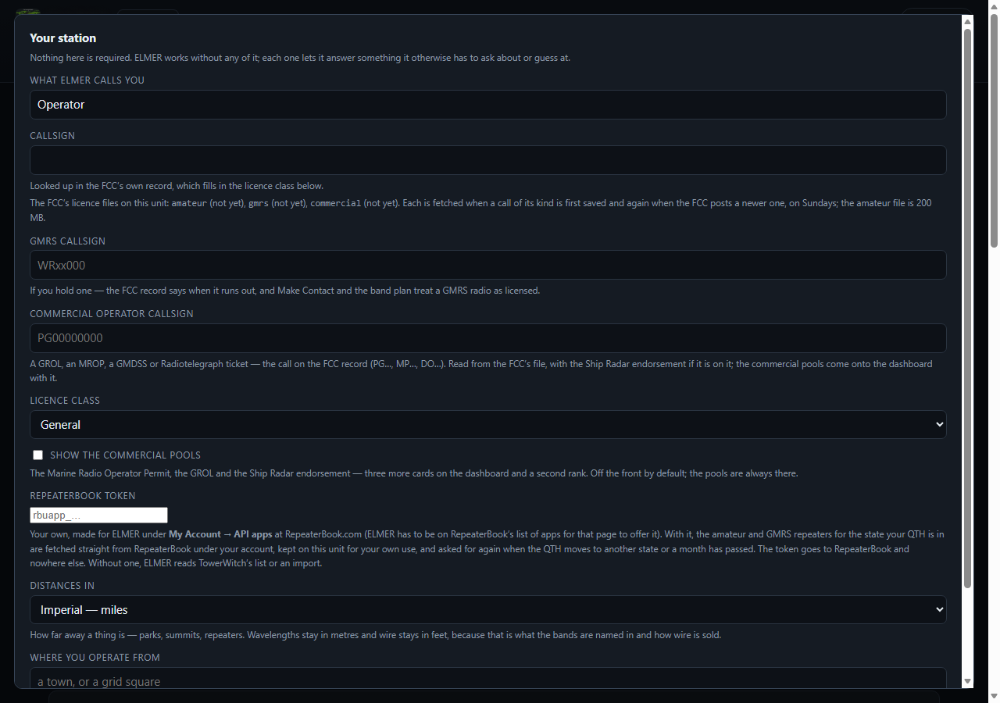

### Who is playing

Click the operator chip for the menu **Who is at the controls?** It lists every account on the unit, lets you add one with a name and an optional callsign, rename, set or change a password, and remove an account from the unit's own screen. A password stops somebody else on the unit answering questions as you, or deleting what you have done. It travels over the network in clear, so choose one you do not use elsewhere. Removing an account takes its progress, titles, notes and streak with it, and it cannot be undone.

**Sealed with your password.** An account with a password has its private data sealed: where you operate from, any token such as the RepeaterBook one, and your notes on questions. Sealed means the database file gives them to nobody - not somebody with the disk, not a backup, not the next person at the controls - because the key is made from your password and ELMER keeps it only in memory while you are signed in. Your name, callsign, rank and streak stay plain, since the room's boards show them and a callsign is a public record; so does the study record itself, which the streak and the scheduler count from and which a forgotten password should never take away. When you first set a password ELMER shows a recovery code once: write it down. The moderator key can open your account for a forgotten password but cannot open the seal; the recovery code is the only other way in, and without it a forgotten password loses what was sealed. After ELMER restarts, or on another browser, the account menu shows **Unlock**; your password opens both the account and the seal. Taking the password off unseals everything back to plain.

**A shared unit.** The Station dialog asks whether this unit is one person's or shared, and the account menu asks the same thing the first time a second account is about to be made. On a shared unit, the person at the controls is asked to put a password on their own account *before* the second account exists. That order matters: an open account can be switched into by anyone and given a password by anyone, and the first person to do that would own it, so the question is put at the one moment its owner is certainly the one at the controls. Leaving it open is a real answer and is not asked again. On a shared unit a saved token, such as the RepeaterBook token, needs a password on the account, and once saved a token is never shown again anywhere; the self-check names any account on a shared unit that is still open.

## Studying for the exam

### The cards

Each question pool has a card on the dashboard: Technician, General and Extra under **Amateur radio**, and with the switch on, the Marine Radio Operator Permit, the GROL and the Ship Radar endorsement under **Commercial**. A card shows three numbers. **Mastery** is ELMER's estimate of your chance of knowing an average question right now. **Exam odds** is your chance of passing, from thousands of simulated exams against your record, and it stays deliberately pessimistic while more than a third of the pool is unseen. **Coverage** is how much of the pool you have met. Five buttons: **Study**, **Weak spots**, **Mock exam**, **Progress** and **Browse**.

Some pools are gated until you have shown something in the one before. A gated card says why, and **Open every pool anyway** does what it says.

### The drill

One question at a time. Five modes across the top: **Drill** puts due reviews first and then new material; **Weak spots** starts with the lowest mastery; **New** shows only what you have never seen; **Lapses** returns to what you have got wrong; **Contest** is a fast random round against a clock.

The keys: `1` to `4` or `a` to `d` answer, `space` or `Enter` moves on, `?` reveals the answer and counts as wrong, which is the honest thing to do. After you commit, the card opens: whether you were right, the XP, when it will come round again, and underneath, why this is the answer, what to watch out for, the concept it belongs to with a link to try it in the Lab where one exists, and the FCC rule with a link to the section. There is a box for your own note on any question, saved with the account.

### The mock exam

Built the way the real one is: the right number of questions, exactly one drawn at random from each section of the syllabus, choices shuffled, and the pass mark the real exam uses. The timer is a pace target you set yourself, not an official limit. Flag a question with `f` and come back to it from the question map; **Submit exam** scores it. The result shows the score by subelement and lets you review every question you missed, with the right answer in green and yours in red, then offers to drill the weak spots. Every answer here also feeds your review schedule.

### Progress, and browsing the pool

**Progress** is where you stand in one pool: mastery, pass probability, likely score with its range, coverage, the weakest sections to drill first, your recent mock exams, and thirty days of study as a bar chart. Below that, for somebody running a class, **Where people on this unit get lost**: the hardest questions measured from how everyone on the unit went, nobody named.

**Browse** is the pool as a book: every question in a section with the key marked and the explanation under it. Choices are in their published order here; in drills and exams they are shuffled, as they are on the real test.

## Band conditions

The **Propagation** page is the live sky. Set your QTH at the top of it, a grid, coordinates or a place name, or press **Locate me** if the unit has a fix. The verdict comes first, in a sentence, then four tiles for the solar flux, the K index, the A index and the sunspot number, then the HF wall chart and the VHF outlook.

The wall chart is N0NBH's, and the page says what it is and is not: eight figures, not hourly, not for your location, one word covering a whole group of bands. The band plan asks the same question band by band and hour by hour from the reading nearest you, and the two sometimes disagree; when they do, the band plan says so and explains why. Under the chart, **What these numbers mean** explains each indicator with its live value beside it, and **Take it to the pool** goes straight to the exam sections about propagation.

The numbers come from hamqsl.com and NOAA's Space Weather Prediction Center, cached for fifteen minutes, and the ionosonde readings through prop.kc2g.com. Where the page says *Est.*, no sounder was in range and the model is standing on its own. Without a network the strip says so.

**The sondes that vote.** The critical frequency over you is the model's figure corrected to meet the sondes within five thousand kilometres, each with a vote weighted by its distance and by the age of its reading. The line under the numbers names them, marks any whose reading was held from an earlier fetch after the feed missed a cycle, and says how far the correction would move if any one of them dropped out. That last figure is the one to read when two units side by side disagree: a thin panel far from the nearest sounder can swing by a third on one vote, and the page now says so instead of leaving two screens to argue. The weekly field report, if you have switched it on, carries how steady the panel was over the week and nothing that names your station.

**Calibrate my forecast**, at the foot of this page, runs the propagation model blind over the last quarter, half year or year against the ionosonde record and grades it, so you can see how much to trust the band plan's verdicts. It needs the network for the first minute; nothing leaves the unit.

## The band plan

What the law allows, and what convention puts where. Pick the **licence class** at the top, or enter your callsign in the strip below it and ELMER uses your actual privileges and tells you when the licence expires. Each band is a button; the chosen band shows its bar coloured by activity, with the parts your class may not transmit on hatched out, the privileges for your class beside the rule that grants them, and a table of what happens where and whether you may use it in that mode.

Every band has its own colour, the same wherever its name appears in ELMER: on the buttons here, on the reach map, on the Lab's chips, in the propagation outlook and on the printed chart. The colours run with the spectrum, red at 160 metres through green to blue at 10 metres, then violet and pink above, so a band you have not learnt yet can be placed by its neighbours.

**Regional coordinator.** The local frequency coordinator's plan, fetched from their site and drawn beside the national one. With a QTH set, the coordinator for your state is picked on its own.

**Where the band reaches from here, now.** For the HF bands, a map of the world in the band's own colour, bright where the band is good from your QTH at this hour and dark where it is shut, with the night side shaded and the terminator as its twilight. Drag to look round, use the wheel, a pinch or a double tap to zoom in, and the model is asked again for that window in finer detail. It is a model from one sounder's reading and it is labelled as one; what it is right about is the shape. Choose one way or the round trip, and which borders to draw.

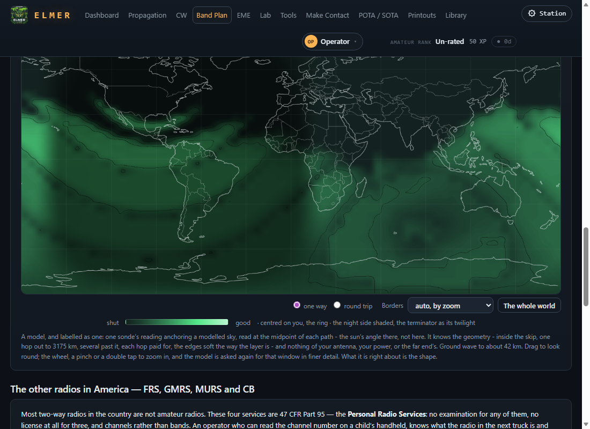

**Zoom and detail are two different things.** The map zooms to twenty-four times, and the corner of it says how far in you are. The detail comes in steps as you go: the whole world is a five-degree grid, and a zoomed window is asked for again at two and a half degrees, then one, then a half at six times, then a quarter of a degree from twelve times on. Past twelve times the picture keeps growing but the cells do not get any finer; a quarter of a degree is about seventeen miles north to south, and that is the end of the detail on purpose. The map's physics is a hop off the ionosphere read at the middle of each path, and the ionosphere does not change from one town to the next, so finer cells would cost the unit time and show the same picture. Where the ground itself decides, at a few miles on VHF, the tool that answers is on Make Contact, below.

**Two antennas, two questions, one map.** The panel under the map takes your antenna, its height, which way it is laid and the ground it stands on, as the Lab remembers them, and the map is weighted by the angle each path leaves at and what that antenna puts there. The **NVIS** switch sets a wire a fifth of a wavelength up, where the ground's reflection adds most straight up, and brings the map in round the station; the line under the map then says whether this band comes back from overhead at all, from the critical frequency over you. Every cell on the map is rated against its own hop's ceiling: straight up that ceiling is the critical frequency itself, at three thousand kilometres it is the sonde's own M(3000) factor times it, and the layer's shape carries the curve between - so the county at noon on 40 metres is rated as the county, crossing the absorbing layer once and nearly straight, and not as a long path. The antenna's weighting keeps the ground's real gain: a wire a fifth of a wave up is credited the reinforcement overhead, and the same wire half a wave up is charged the dip there. The map's colours run out near the top, so a line under it says the height's effect in numbers: the wire's height in wavelengths on this band, and its gain against a dipole in free space straight up, at 45 degrees and at 20 degrees, with its best angle - a quarter wave up reads some four decibels of reinforcement overhead, half a wave up a seven-decibel dip. **The watts and the mode** beside them decide one thing only: the ground wave, the part of the signal that crawls along the surface and fills the hole inside the skip. A narrow mode hears deeper into the noise, so CW carries further than SSB and FT8 further than CW; AM is the widest, and its watts are the carrier. The sky does not care what is modulated onto it, so the rest of the map is the same whichever you choose. On 11 metres the panel holds to the law: 4 watts of carrier on AM or FM, 12 watts PEP on SSB, no CW or data, whatever was in the box, and the note under the map says so.

**The charts.** **One page (PDF)** prints a single landscape sheet with your privileges filled in and coloured by what you may do; **Full chart (PDF)** prints the whole plan band by band. Both land on the Printouts shelf and open in the viewer. A chart printed for a class you do not hold says on its face that it is a study sheet, not a licence.

**The other radios in America.** FRS, GMRS, MURS and CB, the Part 95 services, with their channels and the rules cited, because most two-way radios in the country are not amateur radios. And the **NIFOG**, the national interoperability field guide, with the caution that nearly nothing in it is amateur spectrum: monitor freely, transmit only where you are licensed to.

## CW

Learn it, copy it, send it, and decode what is coming out of the receiver. The settings bar at the top is always in view: tone, volume, character speed and effective speed. The two speeds are Farnsworth timing, characters sent fast with the gaps stretched, so you learn the sound of a letter at the speed you will eventually copy it.

- **Today** is the door. Your record decides the lesson and one press runs the session: meet a character, copy against the clock, groups, words. After each key a chime or a buzz, and if you tick **say what was sent**, the phonetic name of what it was.
- **Learn** is the Koch method: a lesson slider from two characters to forty, hear this lesson's characters, start copying them, and a grid of where you stand, green for copied reliably, amber for shaky, red for needs work, grey for not met yet.
- **Chart** is the whole code, click anything to hear it, with the dits and dahs drawn to length and the prosigns run together.
- **Copy practice** and **Send text** are what they say. Prosigns go in angle brackets, `<AR>`, `<SK>`, `<BT>`.
- **Your sending** is a keyer: straight key, iambic A or B, a big hold-to-key button, and two levers you can bind to any keys. A keyboard is a poor paddle, because most cannot report two arbitrary keys held at once; the Ctrls or the Shifts work, and so do the on-screen levers. A real paddle wired to the bound keys works best.
- **Your rating** measures your copying and your sending in words per minute and keeps both with your account. The CW games set their level from it.
- **Decode off air** listens through the microphone and decodes what it hears. Point the microphone at the receiver's speaker; the page asks for microphone permission the first time.

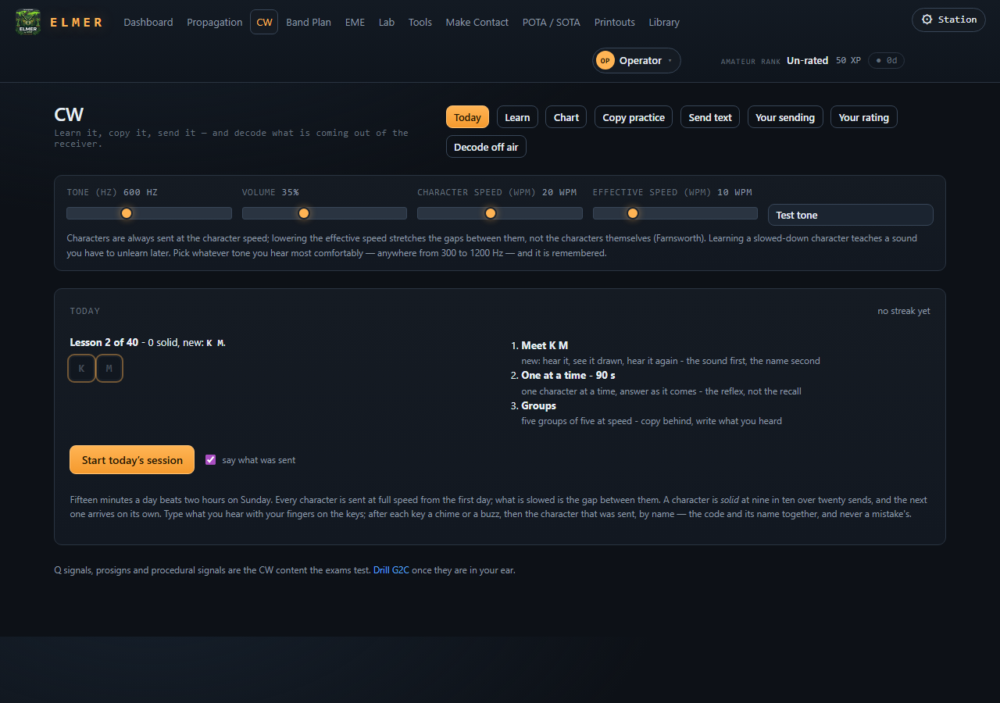

Nothing on this page needs a network.

## EME

The moon, from a clock and a place, nothing fetched. Where the moon is from your QTH, whether the moonbounce window is open, and a map of the world showing who else can see it: drag the slider through the next four days and watch the window sweep, tap a place for its opening and closing times. Beneath it, what the numbers mean: distance, which is about two decibels between perigee and apogee, declination and the sky noise behind it, and separation from the sun. The meteor calendar is here too, with the showers and what they are good for. Point a dish with a real ephemeris; decide whether to bother tonight with this.

## The Lab

The maths the pools test, made movable. Change an input and watch what the formula actually does, then go and drill the section that asks about it. The tabs:

- **Ionospheric hop.** A band chip or a frequency, the critical frequency and the height of the layer, and a picture of the rays that bend back and the ones that escape, with the skip zone marked. The defaults come from the nearest ionosonde when there is a network.
- **Ohm & power.** Fill in any two of volts, amps, ohms and watts.
- **Reactance & resonance**, **SWR & feed line**, **Decibels.** Each with a plot or a line.
- **Antennas.** The long one, and the order is deliberate: start with what you have got to work with, a mast, a garden, an attic, a balcony, a vehicle, nothing at home. Then what you want to do with it, the frequency and the power, and the antenna. **Evaluate this setup** draws it: the pattern, the height's effect, the feedpoint, and a reading of what it is good for and what else. **Not sure, suggest one** picks for you. **Print the sheet (PDF)** puts the whole thing on the Printouts shelf. The sliders that turn the picture sit under the plots they move.
- **Smith chart.** R, X and frequency, presets for a resonant dipole and the ways one goes wrong, and a measured sweep from Tools when there is one.
- **Path & line of sight.** Two ends, heights, gains and line losses, and the terrain between them from a thirty-metre elevation model when there is a network. Without it the tool still does the smooth-earth maths and says so.

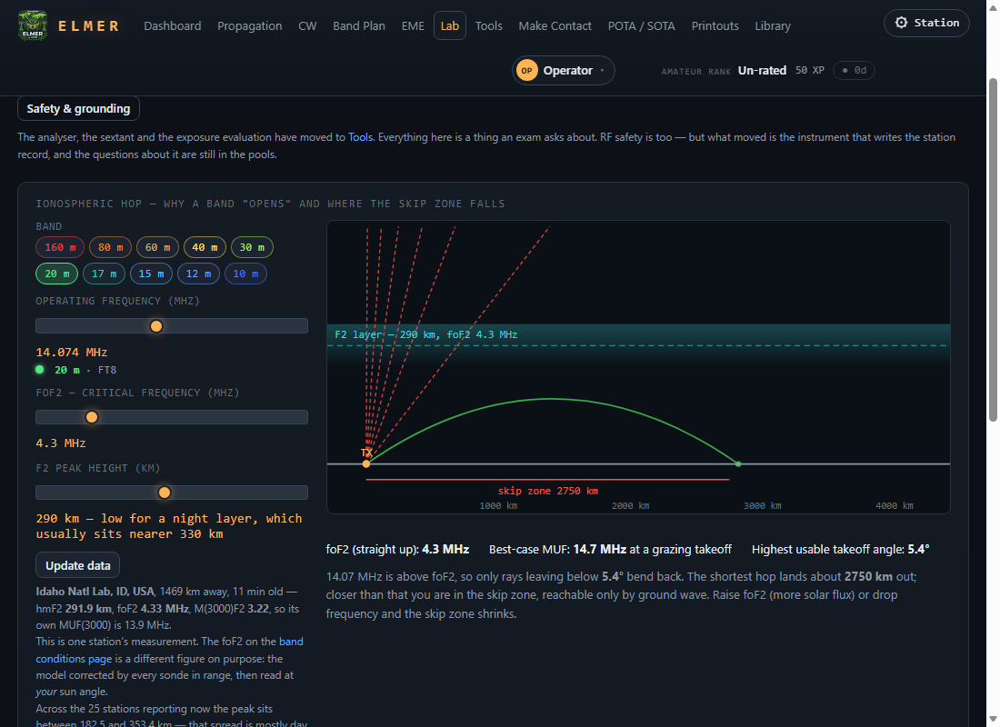

## Tools

The instruments and the settings. The Lab is the material the exams ask about; this is everything else the bench needs.

- **VNA.** A simulator for learning what a sweep looks like, and the real instrument: **Look for a VNA** finds a NanoVNA on a USB port, **Sweep it** reads it, **Export .s1p** saves the sweep. Calibrate it one standard at a time, and calibrate at the far end of the coax you will use; the page has the drill folded under a heading.
- **Sextant.** A sun sight when nothing else knows where you are. What one looks like and what you see through it, then the sights table: reading, time, limb. It needs the time to be right; four seconds of clock error is a nautical mile of longitude.
- **RF exposure.** Since 2021 every amateur station must evaluate its RF exposure and be able to show the result. Add a band, the power, the antenna and the distance, press **Evaluate**, and **Station record (PDF)** writes the record for the Printouts shelf.

There is a panel at the foot of this page headed **Developer, reset this unit**. It is for the author's bench, it only works from the unit's own screen, and it is not undoable. Leave it alone.

## Make Contact

Getting a message out: everything worth trying from where you are, best bet first, with what you actually have on hand. Tick the radios you have, a handheld, a mobile, an all-mode rig, HF with a whip or with room for a wire, GMRS or FRS, MURS, CB. The boxes are pre-ticked from the manuals on the Library shelf, and the page says so. Choose the licence class and press **What can I reach?**

With a QTH set, the answer is local: the repeaters within reach and the bands open now. Type a callsign, a grid or a town into **Reaching somewhere in particular?** and the path tool works out how to get there, asking the same question for three licence classes so it can say what the far end needs. Below the answer, **Getting on the air, your track**: the steps to a first contact, each saying how, how you know it worked, and what to do when it does not, with a box to mark each one done. The day of a first contact is one people remember, and ELMER keeps the date.

**By the numbers on VHF and UHF.** The path answer says whether the ground clears between the two ends, and past the horizon that it does not, which is true and is not the whole answer: a 2 metre signal does not stop at the horizon, it loses so many decibels getting past it, and whether the contact is made is whether the radios have those decibels in hand. So under the path there is a link budget. Pick a radio at your end and one at theirs off a shelf that runs from a handheld on its own rubber duck, through a mobile, to a base rig into a Yagi thirty feet up, then the band, the mode and how noisy the receiving end is, a quiet field or a residential street. ELMER adds it up the way a link budget is always added up, both directions: what leaves, what the path costs along the terrain between, what arrives, what the receiver needs, and the margin. The margin becomes odds, because real paths scatter about a figure like this by some eight decibels: twenty in hand is near certain, none is a coin toss, and minus ten is a long shot you may still get on a good day. When the odds are poor, **the step up** names the smallest change on the shelf that would make it, or says plainly that this one wants a repeater between or height at one end.

**The path drawn.** Under the numbers, the ground along the path from the thirty-metre elevation model, the line between the two antennas sagging with the curve of the earth, and the first Fresnel zone as a band about that line, which is the width of clear air the signal wants. The worst of the ground is marked, red where it stands above the line and green where the path clears at its tightest, and a hover reads the ground, the line and the clearance at any point. The vertical is stretched, feet against miles, and the picture says so. The zone on 2 metres is hundreds of feet wide at a few miles, so where it is wider than the hills it runs off the top and bottom of the picture, which is the point: the ground is inside it. This is where finer detail than the reach map's lives, and it is the reason the reach map stops where it does.

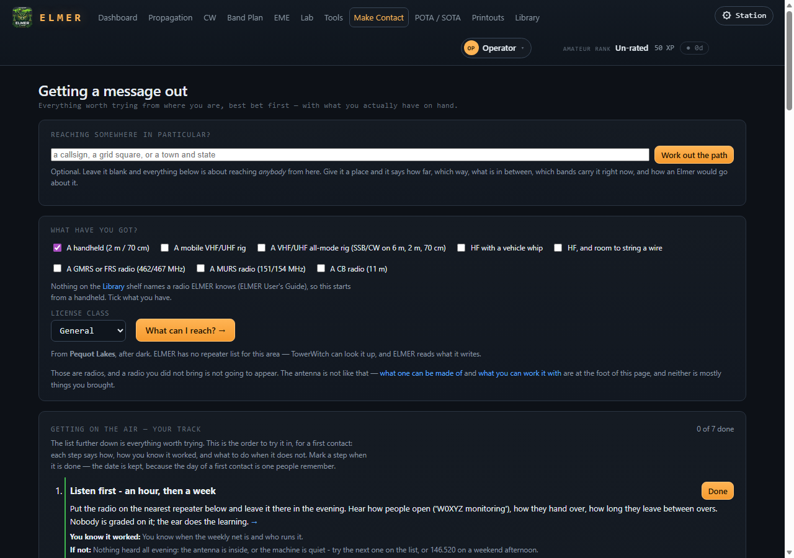

## Parks and summits

POTA and SOTA, the two programmes that give a portable outing a reason. Almost every wasted trip is a planning failure rather than a radio one, and that is fixable at a table days early, for nothing.

**Within a day's drive** fetches the parks and summits between two distances of where you are, or of somewhere you type, and **Print nearest** puts the list on a sheet for the Printouts shelf. **One park or summit** looks one up by name or reference and shows what the people who went there actually did: which bands, which hours, what they said. **What counts** quotes each programme's rules, **Whose land it is** quotes the regulations, and **What you would be carrying** judges your gear against each programme: a vehicle whip is a park antenna and a disqualification on a summit. Neither programme can give you permission to be somewhere.

## Printouts

Everything this unit has built as a PDF, kept here so it can be read and printed without leaving ELMER to go looking for a downloads folder, which on a full-screen Pi is three feet away and out of reach. Five things print: the band card and the full band chart, the antenna sheet, the RF exposure record, the nearest parks and summits, and the certificates from a game night. Each row has **Open**, **Save a copy** and **Delete**. The last thirty are kept and the oldest drop off by themselves. Nothing here is the only copy of anything; every one of them is rebuilt by the button that made it.

## The Library

Your own manuals, read once and indexed to the page. Copy a PDF into the shelf folder, or hand one over from a phone with **Add a manual**, and the next visit to this page reads it. Then **Find the page** answers a question at a campsite from your own copy: the file, the page, and the lines around it. Nothing is summarised or guessed. Every word must be on the page, a quoted phrase is kept whole, and nothing is stemmed, so that the search can never be found to have invented a match.

The page needs poppler, a set of PDF tools. Without it the page says so, and on Windows the dashboard's self-check offers to install it.

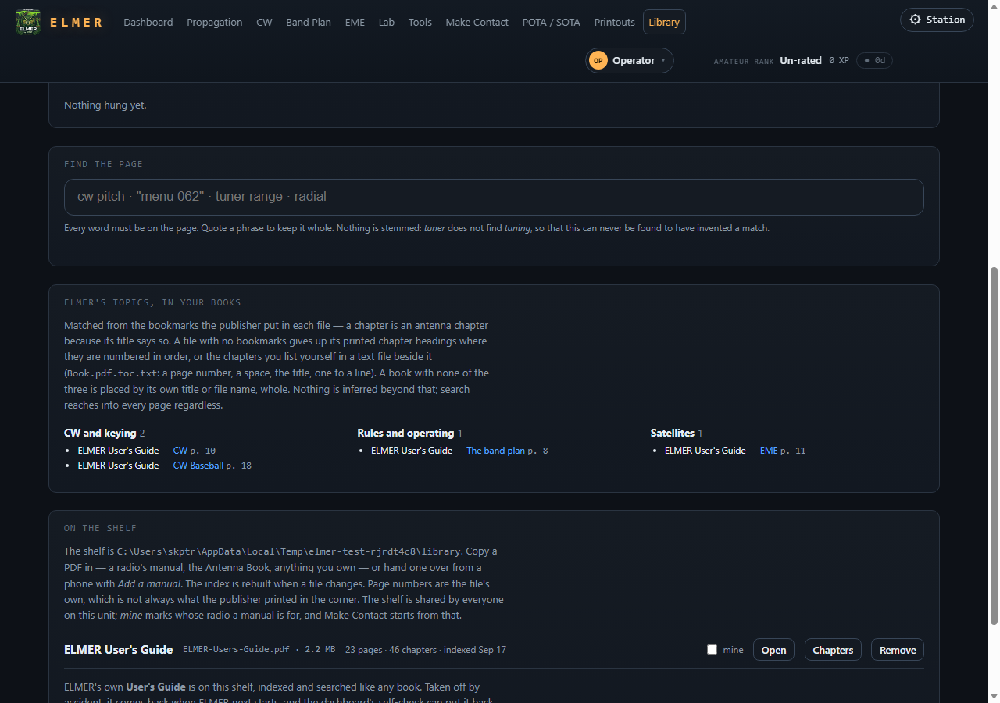

**Open** reads a book inside ELMER, with the chapters down the side, search hits highlighted, page turns by click or arrow key, and Escape to come back. **Open as PDF** in the reader's bar hands the file itself to your browser's own viewer, in a tab of its own, opened at the page you were on; that viewer's toolbar has print and save, so any page of any book on the shelf, this guide included, can be printed from there. On the kiosk, which has no tabs, the same button shows the file in the reader's frame with Back still above it. **Chapters** lists the publisher's bookmarks, or a list you wrote beside the book, or the numbered headings ELMER found. **mine** marks whose radio a manual is for, and Make Contact starts from that. The shelf is shared by everyone on the unit.

**Your licences.** Hand over the PDF of your licence and it is kept for you alone, compared with the FCC record, and shown back to you on the Papers page with a **Print** button. The FCC's record is the licence and the paper need not be carried, but a printed copy is what an inspector or a repeater owner will ask to see, and this is where yours is.

**Your wall.** Hang a certificate, a picture with a title, a line about it, who issued it and when, and it appears framed in the Lounge.

### This guide

This guide is on the shelf with your manuals, indexed and searched like any book and opened in the same reader, so a kiosk with no file manager still has it. The text it is built from is `USER-GUIDE.md` at the top of ELMER's own folder, beside the README, where you can read it without starting ELMER at all; the shelf's copy is built from it when ELMER starts, and rebuilt when the text changes with an update.

It can be taken off the shelf like any other book. Taken off by accident, it comes back when ELMER next starts, and the dashboard's self-check has a **Fix** that puts it back sooner. If you do not want it, tick **I decline the User's Guide and any future updates to it** under the shelf on the Library page. It is taken off then and not put back, by a start or by an update, until you untick the box. That is a setting of the unit, not of the person signed in, because the shelf is shared.

## The Gaming Center

A study tool assumes one person and a quiet evening. A club night is neither. The Gaming Center runs a game on one table's questions, with everyone on their own phone, and every question answered counts for the player who answered it.

### The table screen

Open it from any pool card, or from **Gaming Center, this table only** on the dashboard. The screen that sits on the table shows a QR code; a phone on the same wifi scans it and lands on the join page. Two people can also play at the screen itself, side by side, from the two seat rows: a name, a class if you care to say, and **Sit down**.

On the right, the games. Pick the class and the seconds a question, then a tile. **practice opponents** fills the table with practice players so a game can run before the room has arrived. **Ask one question** puts a single question up without a game. **Certificates** prints one page a placing for the wall, with the event, the host, the date and the signatory as they should read.

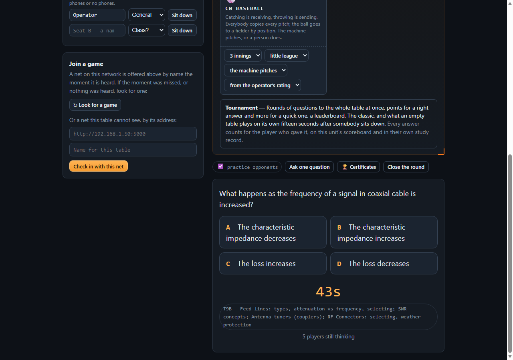

### The phone

Scan the code, or type the address the table shows. The join page asks what to call you, the name you want on any certificate, and the licence class you hold if you care to say, which changes nothing about how you play. Then the game: four big answer buttons, or the clubs and the key the other games need.

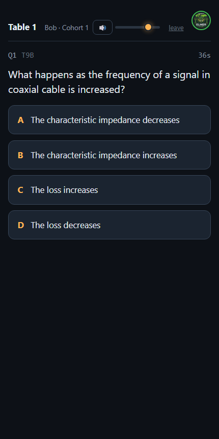

The phones talk only to the table's own unit. Nothing about a game leaves the room.

### Tournament

Rounds of questions, points for speed, a leaderboard. Everyone answers the same question at once and scores for being right and more for being quick. The draw copies the shape of the real exam, one question from each section. It runs in blocks of twelve, and a winner is declared at the end of every block, because a hall that declares somebody every ten minutes gives a table that started badly three more chances. The race is timed by your own phone's clock, not by when your answer reached the unit, so a slow wifi costs nobody.

### Shootout

One player holds the pick and chooses a subject, a section of the pool, and everybody answers a question from it, the picker included. That is the rule from HORSE: the shooter has to make the shot first, so the winning move is not to pick the most obscure corner and wait for the room to fail. Miss a question the picker got right and you take a letter: E, L, M, E, R, five and you are out. A subject can only be spent once. The pick passes when the picker misses, to whoever was fastest among those who got it right. Last one standing wins.

### CutThroat

Musical chairs with questions. Everybody answers the same one, and anyone still in who did not get it right is out; a round where nobody was right eliminates nobody. When two remain, the final is fifteen questions and the better count wins; level after fifteen and it is sudden death. The seated stay: the questions keep arriving on their phone, they just cannot answer, and their place is the order they went out in.

### Golf

The slow game. A real course from its own card, Pebble Beach, the Old Course, Augusta, with each hole's par, yards, hazards and typical wind. A stroke is a question. The player who is away plays and the rest of the group watches; on the tee it is the honour. Nothing is timed. With the question you choose a club, and the club decides how far the ball goes; wind and lie take their yards. A right answer flies. A wrong one is a foul ball into the nearest trouble the club could have reached: water is a drop and a penalty stroke, sand means you are in it, rough is a short one that did go forward. On the green a right answer holes it. Scoring is real golf, lowest total wins, with an optional handicap taken off at the end from each player's own study on this unit.

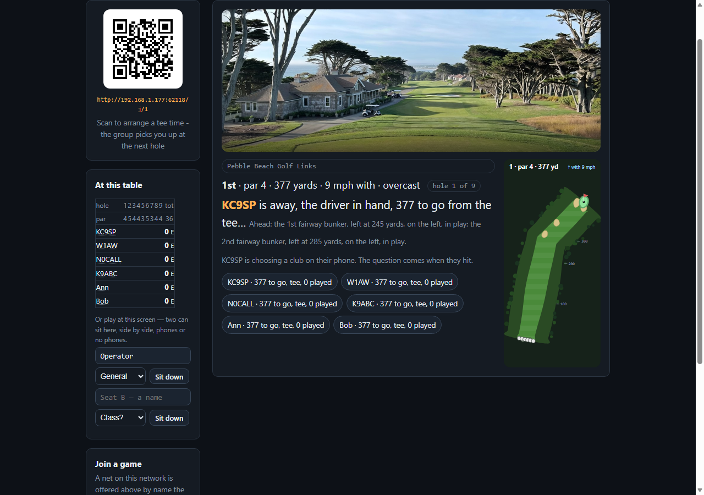

Under the tile: the front nine, the back nine or all eighteen; a tee time so friends can join before the group departs; up to three practice companions, whose strokes are questions put in front of you for free; and the handicap switch. A watcher can answer along with somebody else's stroke on their own phone; right earns a little luck on their next stroke, and wrong costs nothing. The pro shop keeps the record board.

### CW Baseball

Catching is receiving, throwing is sending, and batting is receiving too. A pitch is a transmission in Morse, and copying it clean is a hit sized by what was pitched: a group a single, a word a double, a callsign and a report a triple, a full exchange a home run. A near miss is a foul, a strike until there are two; a miss is a strike; three strikes an out, three outs the side.

**The mound.** The machine pitches when there are not people enough for a pitcher. Otherwise the fielding side's pitcher sees the text on their own phone and nowhere else, chooses how hard a pitch to throw, keys it on the phone's touch key, and throws. A normal pitch is plain code at the level's speed; a hard one has cut numbers, prosigns and punctuation at the top of the speed band, harder to throw clean and harder to copy, and it pays the batter more if it is hit. The umpire is the decoder, and it calls the pitch as thrown: clean, the right text, at speed, is in the zone; clean but the wrong text, or off speed, is a ball; a pitch that does not decode at all is wild, and the runners move up.

**The plate.** Everyone hears the pitch and copies it. The batter's copy is the swing, and it is graded against what actually went out, not what the pitcher was told to send. Swing at a ball and copy exactly what was keyed, wrong letter and all, and it is a hit one base bigger, because you hit a pitch that was never meant to be hittable. Or take the pitch, sending nothing, and bet on the umpire: take a ball and it is a ball, four and a walk; take a strike and in the majors it is a called strike, in the little league it is free.

**The field.** The ball goes to a fielder by position, a fly to the outfield off the big pitches, a grounder to the infield off the small ones. The catch is that fielder's own copy of the pitch, which their phone has been holding since the pitch was thrown. A fly caught clean is the out. A grounder caught clean still has to be thrown: the fielder keys the text to a baseman, whose copy of the throw is the tag; bobble it and the runner is safe on an error. The clock is the runner. With a runner on first a grounder is a force at second, and a clean tag there with time to spare turns into the throw on to first for two.

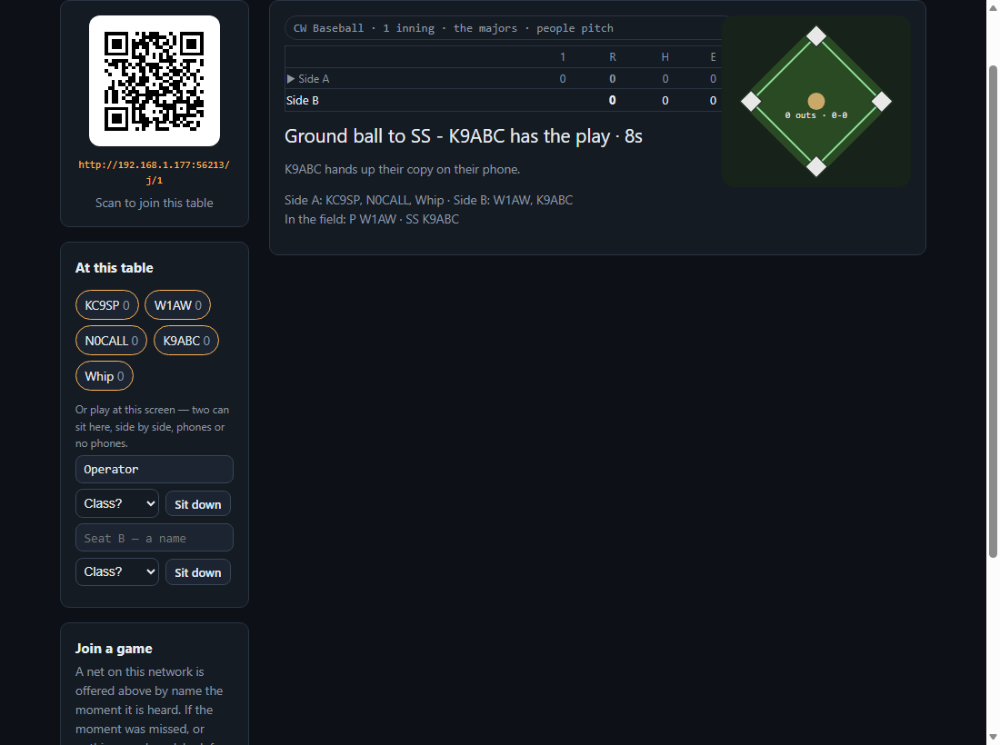

A fielder the ball never reached learns how they copied the moment the pitch is revealed, on their own phone. Under the tile: innings; little league or the majors; the machine pitches or people pitch; and the starting speed, from the operator's CW rating or chosen.

## A club night

### Net control

One unit runs a hall of tables from **Open net control** on the dashboard. It sets the question, keeps the leaderboard and drives every screen in the room. Each table's Pi opens its own Gaming Center, finds the net by name, and checks in; a table can also be joined by typing the net's address. Practice tables stand in for the ones that have not arrived, so the hall runs before anybody has, and a real Pi checking in takes one of their places.

The round controls are the table's: a class, the seconds, **Put a question to the hall**, and the hall versions of Shootout, CutThroat and Golf, where a table plays as one ball, a stroke a question, right if anybody at the table was right.

### The room

Under **The room**, the show. Three modes, Playing, Studying and Intermission, with a lead-in every screen counts down before the question. **Say it to the room** sends a notice or an urgent message to everyone, one table or one seat, and **Attention** blanks every table to a message while you talk. Between rounds, the deck: cards of radio history, standings, sponsors, club notices, the join code and what is next, the same card on every screen at the same moment. The programme lists the event as steps, and **Next step** moves it along.

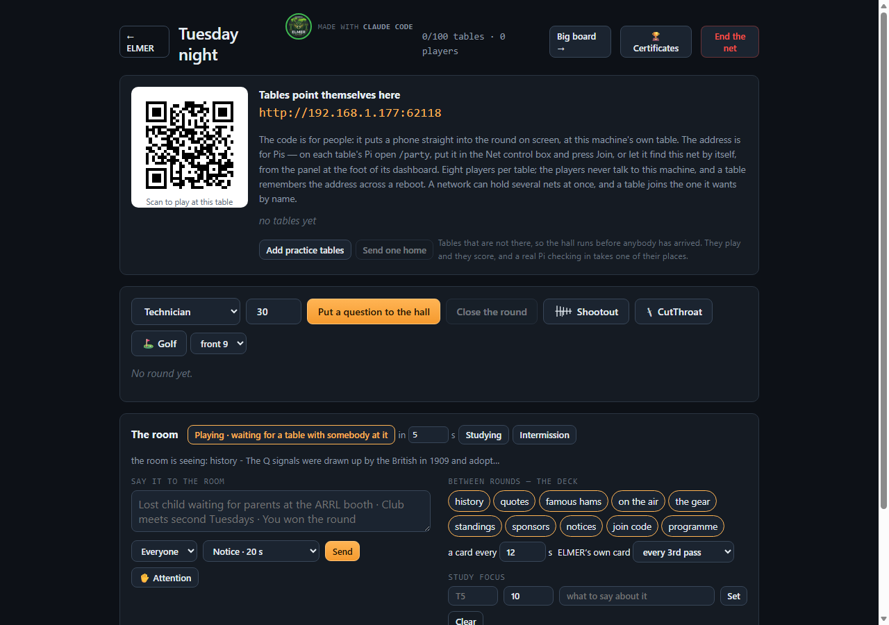

### The big board

The screen at the front of the room. It never refuses: it shows the hall, or a single table, or an invitation to start one, whichever is true. Escape, or the corner, comes back to net control.

### Certificates

From the table or from net control, **Certificates** prints one page a placing, with the event, the host, the date, the place and the signatory as they should read. The pages land on the Printouts shelf, and the details are kept for the next print.

## The Lounge

A drawn room with the signed-in operator's own things in it: the certificates hung from the Library in the frames, newest by the window; the regulars in the small frames; the record board on the counter; and on the screen over the fire, the sky tonight, or the tee time when the clubhouse has one booked. Hover a frame, or tap it, and the certificate lifts off the wall for a closer look. The room is everyone's; the things on the walls are yours.

## Keeping ELMER healthy

### The self-check

On the dashboard, **Check this install** runs the same checks as `./elmer.py --doctor` and lists them: the question pools, the diagrams, the database, poppler, the kiosk, updates, GPS, repeaters, the other ELMERs on the network, mail home, the machine's own load, the space weather feed, the Library and this guide, and finally the port. Each line is a tick, a warning or a fault with a sentence. This looks; it does not change anything. Where a line has one known remedy and you are on the unit's own screen, a **Fix** button does that one thing when pressed and says what it did: put ELMER on the Start Menu, install poppler, connect a copied install to the repository, put this guide back on the shelf, and a few more.

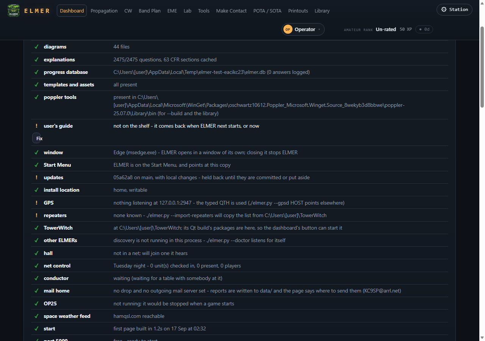

### Updates

The Software panel on the dashboard names the build this unit runs, and under it the people whose support pays for ELMER's testing; the list is SUPPORTERS.md at the top of ELMER's folder, beside this guide. ELMER checks the repository it was installed from and tells you what it finds, on the dashboard, with the waiting changes listed by subject. It never applies an update on its own. **Update now** is always your press, whenever it suits you, and updating is a fast-forward that never happens while there are local changes on the unit. A copy that was downloaded as a zip rather than cloned has no link back and cannot update itself; the Windows quickstart says how to give it one.

### Send feedback

Three presses, and nothing leaves on the first two. **Send feedback** asks what kind of thing this is - a problem, a question, a suggestion or a comment - and gives you a box for your words. **Write it** writes a file and shows you where it is. A problem carries the versions, the recent errors and the tail of the log beside your words, because that is what finds the fault; a question, a suggestion or a comment carries your words and the build you were looking at, and nothing from the log. Your callsign, QTH and network addresses are taken out of all four unless you tick the box to put your callsign on, so a reply can reach you. **Read it before you send it** opens the text. **Send it** sends what you just read, by the drop, a public address that only takes reports in, or through your own mail server if you have set one up under **Mail home**. If it cannot be sent, the page says how to get it there by hand.

**Send a weekly field report** is a switch, off until you turn it on, with the server's own description of what it carries beside it and a button to read exactly what would be sent.

### The log

Every page keeps a log on the unit at `data/elmer.log`. The dashboard's **Recent log** fold shows the warnings and errors, and a reference like `e-3f9a` from an error page can be typed into the box beside it to find the lines it refers to, so a kiosk with no terminal behind it can still say what happened.

### The command line

Everything above has a command-line form for a unit reached over a network or a terminal. The common ones:

- `./elmer.py` serves on port 5000; `--kiosk` opens full screen with the Exit button; `--port` and `--host` change where.
- `./elmer.py --doctor` runs the self-check and prints every address to try.
- `./elmer.py --update` pulls the latest ELMER and restarts onto it; `--update-check` only reports.
- `./elmer.py --report` writes a problem report with the station's identity taken out; `--report-with-station` leaves it in, only if you have read it.
- `./elmer.py --prepare PLACE` fetches what ELMER needs about somewhere you are going while you still have a network, and `--trips` lists what is prepared.
- `./elmer.py --index-library` indexes the manuals on the shelf; `--gps` says whether ELMER will use the GPS; `--import-repeaters` reads a TowerWitch's list.
- `./elmer.py --copies` lists every copy of ELMER on this machine and `--tidy` offers to remove the empty ones, one question each.

`./elmer.py --help` lists them all.

## What leaves this unit

Nothing about you goes out with any request, and nothing is sent from a unit that you have not pressed for or switched on knowing what it carries.

- **Fetched, automatically, when there is a network:** the space weather, the ionosonde record, the meteor and moon tables, the coordinator's plan, the weather at a golf course, the POTA spot feed sampled every twenty minutes, and the FCC's licence files. None of these requests carries anything of yours.
- **Fetched when you ask:** a callsign lookup with the callsign as the query; a place name to be turned into coordinates; the repeaters for your state under your own RepeaterBook token; a park's record.
- **Sent when you press:** a problem report, after you have read it. **Sent when you switch it on:** the weekly field report, described beside its switch. Both carry a four-character mark of the unit so two reports from the same unit can be told apart, and nothing else that names you.
- **Never:** your progress, your notes, your answers, your callsign, your QTH or anyone's phone. Progress is kept on the unit in `data/elmer.db`, and the phones at a game night talk to the table's unit and nowhere else.

## When something goes wrong

- **A red bar on a page** saying something went wrong: the details are in the log, and the dashboard's log fold finds them by reference.
- **Lost contact with the ELMER server:** the unit stopped, or the network between you and it did. On the unit's own screen, start it again; from a phone, check the wifi.
- **A page says Not open yet:** the pool is gated behind the one before it. **Open every pool anyway** opens them all.
- **The Library says nothing can be read:** poppler is missing. The self-check names it and, on Windows, offers to install it.
- **Locate me is missing:** a browser only offers its position on the unit's own screen. On another device, type the QTH.
- **Nothing on the phone after scanning the code:** the phone is on a different wifi from the unit, or a guest network that keeps devices apart. The address the table shows must be reachable from the phone.
- **The band plan and the wall chart disagree:** they measure different things, and the band plan says which it trusts and why. When in doubt, turn the radio on.
- **A Fix, Update now, Send feedback or Mail home is not offered:** they are offered only to a browser on the unit itself, never over the network.

Anything else: press **Send feedback**, choose "a problem", read what it wrote, and send it.
