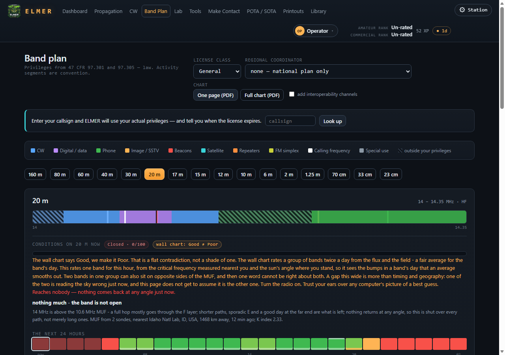

# ELMER on Linux (and, untested, macOS) — quick start

Any Linux with Python 3.11 or later. This is the Raspberry Pi guide without
the Pi: the same clone, the same installer, a virtual environment instead
of apt.

## 1. Get it

```
git clone https://github.com/skpeterson2000/elmer.git
cd elmer
./install.sh
```

Outside Raspberry Pi OS, `install.sh` makes a `.venv` in the folder and
installs Flask, Pillow and reportlab into it — nothing system-wide, no
`sudo`. It says what it intends to do first. poppler-utils (for rebuilding
the pools and reading PDFs on the library shelf) is offered, not required,
and the self-check names it if it is missing.

**macOS** should behave the same way — a venv, the same Python packages —
but nobody has run ELMER there yet. If you do, *Report a problem* on the
dashboard with a line saying so, working or not, and this sentence changes.

## 2. Start it

```
./elmer.py             # serve; open it from any device on the network
./elmer.py --kiosk     # serve, and open full screen on this machine
./elmer.py --doctor    # the self-check, and every address it can be reached on
```

It prints the addresses; open one in a browser here or on a phone on the
same wifi. Port 5000 taken? `./elmer.py --port 5050`.

## 3. What you will see


The dashboard opens on **Start here**: answer some questions (a drill —
pick an answer, and the explanation and the rule it rests on appear
beneath), add a callsign if you have one, set where the station is. The
panel goes away after your first answered question. Several people share a
machine by name from the **who** menu; each keeps their own progress.



## 4. Keeping it current

The dashboard's **Update** panel says what is waiting and applies nothing
until you press *Update now*. `./elmer.py --update` from a terminal does the
same. `./install.sh --repair` restores changed files from the repository —
it says so first, because that throws local edits away.

## If something is wrong

- **Self-check** on the dashboard (or `--doctor`), with a **Fix** beside any
  line that has one known remedy.
- **Report a problem** on the dashboard: your words, the log with account
  names taken out, shown to you before anything is sent.
- `data/elmer.log` has everything. The tests never touch `data/`
  ([The tests cannot reach your data](../DESIGN.md#the-tests-cannot-reach-your-data)).

## Where the rest is

The [README](../README.md) is one screen; the reasoning is
[DESIGN.md](../DESIGN.md):

- [What's in it](../DESIGN.md#whats-in-it), [Fidelity](../DESIGN.md#fidelity),
  [The Gaming Center](../DESIGN.md#the-gaming-center),
  [Getting a message out](../DESIGN.md#getting-a-message-out),
  [Where the station is](../DESIGN.md#where-the-station-is),
  [The library](../DESIGN.md#the-library-your-own-manuals-to-the-page),
  [Commands](../DESIGN.md#commands), [Keyboard](../DESIGN.md#keyboard),
  [Kiosk mode](../DESIGN.md#kiosk-mode), [Sharing one unit](../DESIGN.md#sharing-one-unit),
  [Keeping it up to date](../DESIGN.md#keeping-it-up-to-date),
  [When it goes wrong](../DESIGN.md#when-it-goes-wrong).
