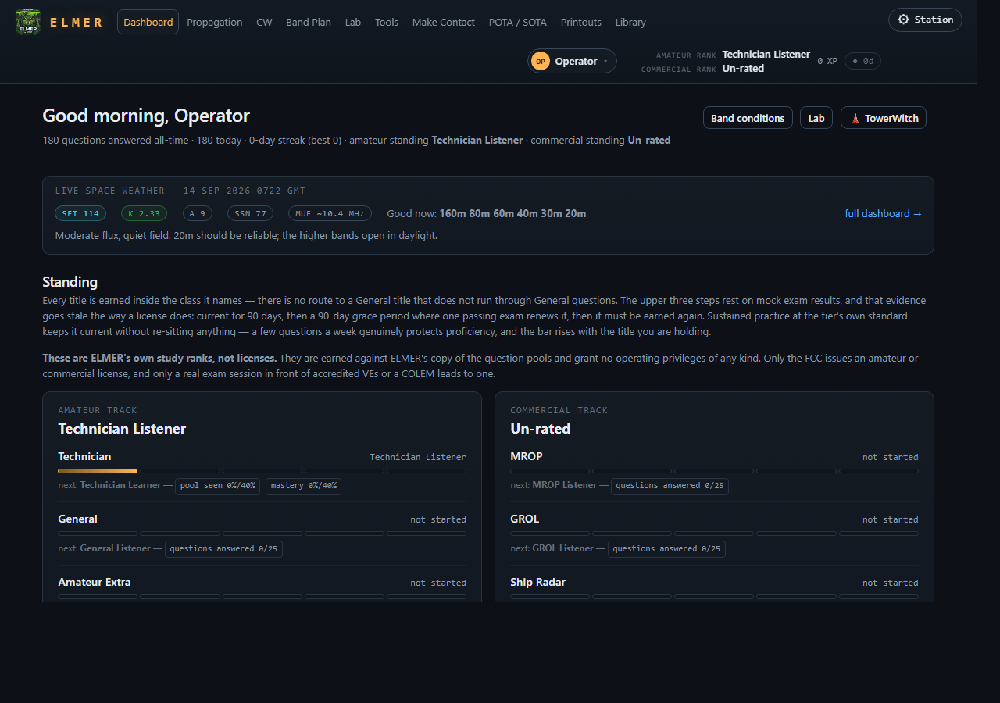

# ELMER on a Raspberry Pi — quick start

A Pi 4 or 5 with Raspberry Pi OS, a network, and about fifteen minutes.
This is the platform ELMER was built on: the study unit in the shack, the
kiosk at the club, the table at a hamfest.

## 1. Get it

Open a terminal (or ssh in) and:

```
git clone https://github.com/skpeterson2000/elmer.git
cd elmer
./install.sh
```

`install.sh` checks what is on the Pi, says what it intends to do, and asks
for `sudo` only if a system package is genuinely needed — Flask, Pillow and
reportlab come from apt, because Raspberry Pi OS refuses `pip install` and
should. Run it again any time; it puts back what is missing and touches
nothing else (`./install.sh --repair` restores changed files from the
repository, and says first that it will).

## 2. Start it

```
./elmer.py             # serve; open it from any device on the network
./elmer.py --kiosk     # serve, and open full screen on this Pi's own screen
```

It prints every address it can be reached on:

```
  ELMER is on http://192.168.1.5:5000
```

Open that on a phone or laptop on the same wifi, or use `--kiosk` on a Pi
with a screen attached. `./elmer.py --doctor` runs the self-check from the
terminal and prints the same addresses.

## 3. What you will see



The dashboard opens on **Start here**: answer some questions (*Start with
Technician* is a drill — pick an answer, and the explanation and the rule it
rests on appear beneath), add a callsign if you have one (the FCC record
supplies class, expiry and grid), and set where the station is — a grid
square, a town, or a GPS if one is plugged in or a TowerWitch is on the
network. The panel goes away after your first answered question.

Several people share a Pi by name: the **who** menu top right. Each keeps
their own progress; an account can be locked if the Pi is on a shared
network.

## 4. Making it a station

- **Autostart and kiosk.** [Putting it in the menu](../DESIGN.md#putting-it-in-the-menu)
  and [Kiosk mode](../DESIGN.md#kiosk-mode): a desktop entry, and a Pi that
  boots straight into ELMER full screen with no keyboard on it.
- **GPS.** gpsd on the Pi, a phone streaming to it, or a TowerWitch beside it
  — ELMER takes whichever it has, says which, and says which antenna to move
  when the fix goes ([Where the station is](../DESIGN.md#where-the-station-is)).
- **Repeaters.** Paste your own RepeaterBook token (*My Account → API apps*
  at RepeaterBook.com) into **Station** and the amateur and GMRS machines for
  your state are fetched under your account. Or from
  [TowerWitch](https://github.com/skpeterson2000/TowerWitch) installed beside
  ELMER, or `--import-repeaters` once to keep its list on a Pi without one.
- **A club night.** Open the **Gaming Center** from any class card: a table
  of players joins by QR code from their own phones. A hall of tables is one
  more Pi running **net control**; the tables find it by themselves
  ([The Gaming Center](../DESIGN.md#the-gaming-center)).
- **Somewhere the internet is not.** Everything serves without a network;
  what needs one is fetched once and kept
  ([Packing for somewhere the internet is not](../DESIGN.md#packing-for-somewhere-the-internet-is-not)).

## 5. Keeping it current

The dashboard's **Update** panel checks about once a day and says what is
waiting. **Nothing is applied until you press *Update now***; a Pi in a
shack never changes under the person studying at it. `./elmer.py --update`
does the same from a terminal.

## If something is wrong

- **Self-check** on the dashboard, or `./elmer.py --doctor`: pools,
  database, network, GPS, the net it remembers, the mail path, the port.
  Where a line has one known remedy, the dashboard offers a **Fix** beside
  it.
- **Report a problem** on the dashboard: what happened in your words, the
  log with account names taken out, shown to you before anything is sent.
- `data/elmer.log` has everything; `journalctl -u elmer` if it runs as a
  service.
- Common ones: *nothing listening at 127.0.0.1:2947* — no gpsd, the typed
  QTH is used, which is fine; a phone cannot reach the address — it is on a
  different wifi, or the Pi's hostname changed; *held back until local
  changes are committed* — somebody edited a file on the Pi, and
  `./install.sh --repair` puts it back.

## Where the rest is

The [README](../README.md) is one screen; the reasoning is
[DESIGN.md](../DESIGN.md). The parts a Pi owner meets first:

- [What's in it](../DESIGN.md#whats-in-it) — the pools, the study modes, the
  mock exams, the ranks.
- [Fidelity](../DESIGN.md#fidelity) — what is quoted, what is measured, and
  what leaves a unit (nothing, unless you press for it).
- [The Gaming Center](../DESIGN.md#the-gaming-center) — Tournament, Shootout,
  CutThroat, Golf; the table, the hall, net control.
- [Getting a message out](../DESIGN.md#getting-a-message-out) — Make Contact,
  and reaching somewhere in particular.
- [The library](../DESIGN.md#the-library-your-own-manuals-to-the-page) — your
  own manuals, indexed to the page.
- [Mail home](../DESIGN.md#mail-home) and [When it goes wrong](../DESIGN.md#when-it-goes-wrong).
- [Sharing one unit](../DESIGN.md#sharing-one-unit) and
  [Keeping it up to date](../DESIGN.md#keeping-it-up-to-date).
